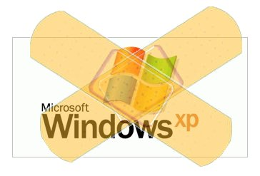

أعلنت Microsoft عن قائمة التصحيحات الستة التي ستصدرها غدا الثلاثاء.

من ضمن هذه التصحيحات الستة ، أربع تخص أنظمة Windows  التالية: XP,Vista, Windows 2000 و Windows Server . ثلاث منها توصف بالحرجة "Critical".

أما فيما يخص التصحيحين الآخرين و الموصوفان بالهامين  "Important" فهما موجهان إلى كل إصدارات Office.

يمكن قراءة هذا الإعلان بطريقة أخرى حيث أنه لا توجد أية تصحيحات خاصة بنظام التشغيل الجديد Windows 7 ، مما يعطي انطباعا (أو قد يكون هذا ما ترمي إليه Microsoft) بأن Windows 7 خال من الأخطاء.

المصدر:

[http://www.microsoft.com/technet/security/Bulletin/MS09-nov.mspx](http://www.microsoft.com/technet/security/Bulletin/MS09-nov.mspx)
