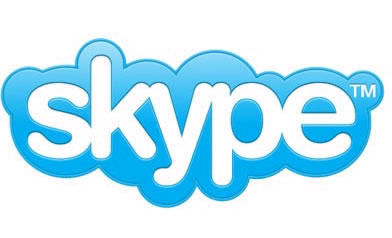

أعلنت eBay أنها توصلت إلى عقد صفقة بالتراضي  مع Janus Friis و Niklas Zennstrom مؤسسا skype ، يسقط بموجبها المؤسسان الدعاوى القضائية التي كانت تعيق عملية بيع خدمة skype  مقابل الانضمام إلى جماعة المستثمرين  المالكين  الذين سيشترون الخدمة.

تسمح هذه الصفقة لمؤسسي skype الحصول على 14% من رأس مال skype فيما تتحصل eBay على 30% . أما الـ 56% المتبقية فستكون ملكا لكل من المستثمرين  Silver Lake Partners ، Andreessen Horowitz و Canada Pension Plan Investment Board .

المصدر:

[http://share.skype.com/sites/en/2009/11/joltid_settlement.html](http://share.skype.com/sites/en/2009/11/joltid_settlement.html)
