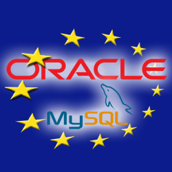

أعلنت المفوضية الأوروبية أمس الاثنين رفضها التام لصفقة شراء sun من طرف عملاق قواعد البيانات Oracle   المقدرة بأكثر من 7 ملايير دولار أمريكي.

السبب الرئيسي لهذا الاعتراض يكمن في كون شركة sun قد قامت بشراء شركة Mysql AB   المالكة لنظام إدارة قواعد البيانات المجاني و مفتوح المصدر MySql، مما يسبب - حسب المفوضية الأوروبية-  احتكارا لسوقي قواعد البيانات المملوكة و المجانية من طرف شركة واحدة.

من جهتها أعربت شركة Oracle عن امتعاضها من هذا القرار، التي تشير بعض الأخبار إلى أن لشركة SAP الألمانية أحد منافسي Oracle يدا فيها، بحكم أن سوق قواعد البيانات  يتنافس عليه أكثر من شركة على غرار كل من Microsoft بمنتجها SqlServer و IBM  بمنتجها IBM DB2 .

مصدر الخبر:

[http://news.cnet.com/8301-30685_3-10393740-264.html?tag=newsEditorsPicksArea.0](http://news.cnet.com/8301-30685_3-10393740-264.html?tag=newsEditorsPicksArea.0)
