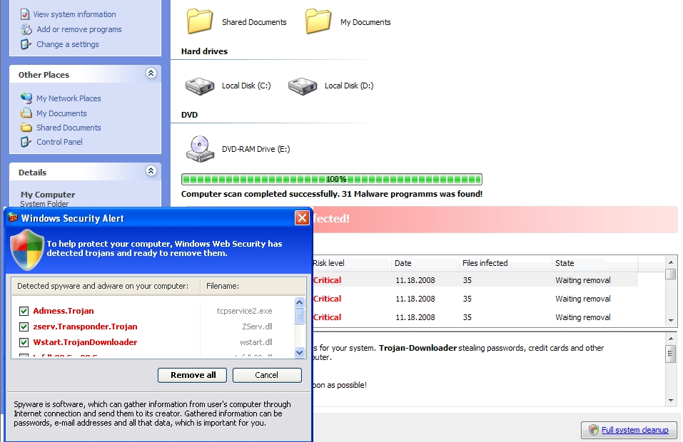
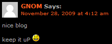
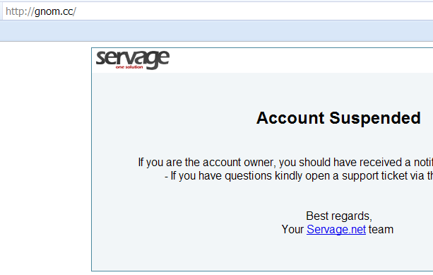

بشكل مثير للسخرية كنت أقرأ البارحة خبراً حول حملة كثيفة من مجتمع Black-Hat باستخدام برامج Badware (البرامج التي تقوم بانتحال أسماء وشكل برامج شرعية وآمنة وتحاول خداع المستخدمين لتثبيتها على أنظمتهم وما هي في الواقع إلا برامج تجسس) حيث يتم استغلال نتائج بحث Google وبشكل معزول عن الطرق الآلية التي تستخدمها Google في كشف المواقع الخبيثة من خلال شبكة متغيرة من الموجّهات redirectors.

تتم محاولات تثبيت هذه البرامج الضارة من خلال مشاركات يتم نشرها في المدونات بشكل آلي تشير إلى مدوّنات وهمية والتي تبدو برئية تماماً لو تمت زيارتها بشكل مباشر، بينما تحاول بشكل عنيف أن تثبت مكافح فيروسات Windows مزوّر والذي يكون عبارة عن trojan horse لو تم الوصول إليها من خلال نتائج بحث Google!

<!-- more -->

[caption id="" align="aligncenter" width="459" caption="صورة للطريقة التي قد يظهر فيها برنامج الحماية المزّيف"]
[/caption]

يتضمن موقع The Unmask Parasites تحليلاً تفصيلياً من جزئين عن حملة البرامج الضارة هذه، والذي يلقي بعض الضوء على مجموعة من الأرقام: حوالي 688,000 مدونة وهمية تروّج لبرامج خبيثة موجودة في Google، بعضها تحوي حتى 1000 تدوينة!

هذا التحليل يشير أيضاً إلى أن العديد من المواقع المخترقة بهدف استضافة مدوّنات وهمية موجودة على شبكة [Servage.net](http://www.servage.net/)

أقتبس عن The Unmask Parasites الجزء التالي:

<blockquote>_What we have here is millions of rogue web pages targeting the long tail of web search (millions of keywords) where each page tries to install fake (and malicious) "anti-virus" software on visitors' computers. While this black-hat campaign is active for at least 6 months, webmasters of the compromised sites and their hosting providers don't simply notice this illicit activity. The good news is Google seems to have noticed this problem. Probably thanks to the Cyveillance blog post. During the week after that post I see a steady decrease in search results returned by the queries that you can find in this post._</blockquote>

أعود الآن للقول، بشكل مثير للسخرية، البارحة وصلتني رسالة تنبيه بأن هناك مشاركة جديدة في مدوّنتي الشخصية في آخر موضوع نشرته "[Perhaps the blog is dead, but..](http://xacker.wordpress.com/2009/11/23/perhaps-the-blog-is-dead-but/)" لأجد المشاركة التالية:

وفي محاولة لرؤية موقع صاحب المشاركة hXXp://gnom.cc فوجئت بأن الموقع مستضاف لدى.. نعم، Servage.net - وقد تم إيقاف حسابه :D

إن دل هذا على شئ إنما يدل على أن الحملة ما زالت قائمة لكن يتم اتخاذ الإجراءات المضادة تجاهها.

**(تحديث بتاريخ 29/11/2009) ****ملاحظة****:** وفقاً لمستجدّات حول ملكية العنوان hXXp://gnom.cc يرجى مراجعة أول تعقيبين منشورين أدناه.

ربما تود مراجعة مشاركات زوار مدوّنتك الآن؟ :)

المصادر:

[Rogue blogs redirect search traffic to bogus AV sites. Part 1.](http://blog.unmaskparasites.com/2009/11/26/rogue-blogs-regirect-search-traffic-to-bogus-av-sites-part-1/)

[Rogue blogs redirect search traffic to bogus AV sites. Part 2.](http://blog.unmaskparasites.com/2009/11/27/rogue-blogs-regirect-search-traffic-to-bogus-av-sites-part-2/)

[http://www.cyveillanceblog.com/general-cyberintel/malware-google-search-results](http://www.cyveillanceblog.com/general-cyberintel/malware-google-search-results)
