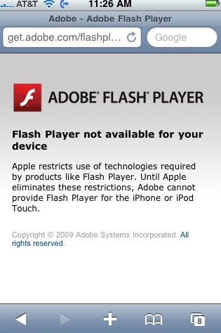

**Microsoft  تطلق حلا لتشغيل محتويات Sliverlight على أجهزة iPhone**

أعلنت Microsoft عن توصلها لمعضلة عدم التمكن من عرض المحتويات الخاصة بـ Silverlight  على أجهزة الـ iPhone .

يعود أصل المشكل أساسا إلى  كون  شركة Apple تسعى جاهدة لمنع باقي الشركات و خصوصا المنافسة لها بتنصيب برامجها الخاصة دون إذنها (أو حتى بإذنها) على أجهزة الـ iPhone.

فما كان على Micrososft سوى التفكير بطريقة مغايرة لتشغيل محتويات Silverlight على أجهزة الـ iPhone، و ذلك بالبحث عن حل من جهة الخوادم  و ليس من جهة أجهزة الـ iPhone نفسها. و ذلك بتطوير طريقة جديدة تمكن خوادم IIS من تحويل المحتويات الخاصة بـ    Silverlight  إلى MPEG2 v8 الذي يدعمه برنامج QuickTime المستعمل على أجهزة الـ iPhone.

تم الإعلان عن هذه التقنية الجديدة من طرف Brian Goldfarb  الـ Experience Platform Manager لدى Microsoft خلال مؤتمر PDC  الأخير الخاص بـ Microsoft.

تجدر الإشارة إلى أن شركة Adobe  لا تزال تعاني من مشكلة منع Apple لها من عمل نسخة خاصة من برنامج Flash player  لأجهزة الـ iPhone  إذ تكتفي بإظهار  الرسالة التالية  لمستخدمي iPhone  في انتظار التوصل إلى حل توافقي مع Apple  أو التفكير في إيجاد حل من ناحية الخوادم مثلما فعلت Microsoft

[المصدر](http://www.betanews.com/article/Microsoft-worked-with-Apple-for-Silverlight-on-iPhone-says-Goldfarb/1259185079)
