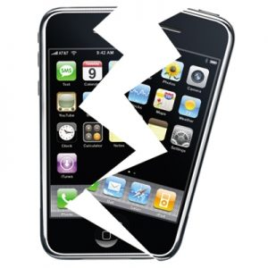

**اكتشاف ثغرة أمنية خطيرة في كل أجهزة الـ iphone بدون استثناء**

أعلن الباحث في الأمن Nicolas Seriot خلال مؤتمر عقد في العاصمة السويسرية جنيف عن اكتشافه لثغرة أمنية خطيرة تخص كل أجهزة الـ iPhones بما في ذلك الأجهزة التي لا تزال حمايتها غير مكسورة.

ظهرت في الأسابيع الأخيرة عدة فيروسات تخص أجهزة الـ iPhone لكن كانت كلها تعتمد على ثغرة موجودة فقط على الأجهزة مكسورة الحماية.

لكن الباحث Nicolas Seriot أكد أن الثغرة التي اكتشفها تخص جميع أجهزة الـ iPhone  حتى تلك الأجهزة التي لا تزال متمتعة بحمايتها، إذ أن مصدر الثغرة  على حسبه يكمن في خطأ تصميمي (يخص نقص الحماية) لبعض أقسام نظام تشغيل iPhone . مما يسمح لأي برنامج ضار يستغل هذه الثغرة بالوصول إلى كل المعلومات المهمة على الجهاز بداية بحسابات البريد الالكتروني   مرورا بتاريخ البحث على Safari و Youtube وصولا إلى ملفات Log الخاصة باتصالات Wi-fi دون أن ننسى إمكانية الوصول إلى كل ما تم طبعه بلوحة المفاتيح، باختصار يمكن الوصول إلى كل شيء.

من ناحيتها رفضت Apple الرد حاليا على خبر اكتشاف هذه الثغرة

[المصدر](http://seriot.ch/resources/talks_papers/iPhonePrivacy.pdf)
