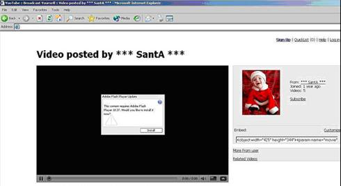
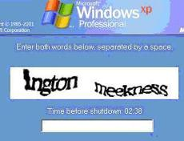

يتم استهداف مستخدمي Facebook مجدداً من قبل إصدار جديد من دودة Koobface المسمى Koobface.GK والتي تحاول جعل المستخدمين يقومون بالتسجيل بـ Facebook بشكل يدوي لمساعدة الدودة على الانتشار.

يقوم المهاجمون بنشر روابط خبيثة على صفحات Facebook wall محرّضين المستخدمين لمشاهدة مقطع فيديو خاص بعيد الميلاد.

بتشغيل مقطع الفيديو ينتقل التحكم بالجهاز إلى المهاجمين، يقول Sean-Paul Correll أحد الباحثين في PandaLabs. بعدها يظهر للمستخدم نافذة تحذيرية خاصة بويندوز تطلب منه أن يقوم بكتابة الكلمات الظاهرة في أحجية CAPTCHA، خلال مدة 3 دقائق.

الفشل في إدخال الكلمات الخاصة بـ CAPTCHA خلال هذه المدة يؤدي إلى توقف الجهاز عن الاستجابة. إعادة التشغيل غير مفيدة في هذه الحالة حيث تعود هذه النافذة للظهور مرة أخرى والطريقة الوحيدة لإغلاقها هي من خلال حل أحجية CAPTCHA، في هذه الحالة يعود التحكم للمستخدم صاحب الجهاز بشكل طبيعي، لكنه يبقى تحت سيطرة المهاجمين.

ظهور هذه النافذة وإدخال الكلمات الخاصة بـ CAPTCHA ما هو في الواقع إلا الخطوة الأخيرة من عملية إنشاء حساب Facebook حيث تقوم الدودة بهذه الطريقة بتجنيد المستخدمين لإنشاء حسابات وهمية تحت سيطرتها و**بدون معرفة من قبل المستخدم بما يحدث في الخفاء**.

المصدر:

[Facebook users unwittingly spread Koobface worm](http://content.usatoday.com/communities/technologylive/post/2009/12/koobface-compels-facebook-victims-to-help-spread-worm-/1)
