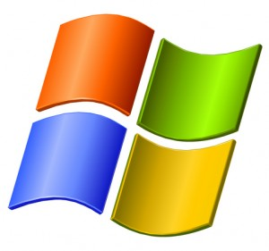

**Microsoft تعلن نهاية دعم Windows2000 و Windows XP SP2 شهر يوليو 2010**

أعلنت Microsoft أنها ستتوقف عن دعم Windows2000 و Windows XP SP2 ابتداء من 13 يوليو 2010.

انطلاقا من هذا التاريخ فإن Microsoft  لن تقدم أي مساعدة أو دعم فني و لا حتى تحديثات تخص هذه الأنظمة، مما سيحتم على أصحاب هذه الإصدارات الانتقال إلى إصدارات أحدث من أنظمة Microsoft .

تجدر الإشارة إلى أن SP3 من نظام  Windows XP لا يزال في قائمة أنظمة التشغيل المدعومة.

[المصدر](http://support.microsoft.com/lifecycle/)
