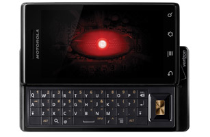

[**جهاز Droid ينضم هو أيضا إلى قائمة الأجهزة المعنية بالـ Jailbreaking**](https://www.it-scoop.com/2009/12/%d8%ac%d9%87%d8%a7%d8%b2-droid-%d9%8a%d9%86%d8%b6%d9%85-%d9%87%d9%88-%d8%a3%d9%8a%d8%b6%d8%a7-%d8%a5%d9%84%d9%89-%d9%82%d8%a7%d8%a6%d9%85%d8%a9-%d8%a7%d9%84%d8%a3%d8%ac%d9%87%d8%b2%d8%a9-%d8%a7%d9%84/)

بعد الـ iPhone  و كسر الحماية التي يعاني منها  (Jailbreaking) ها هو Droid أيضا ينضم إليه، إذ استطاع Hacker يدعى Zinx Verituse  أن يقوم بكسر الحماية الموجودة على الجهاز مما يسمع له بتنصيب أي برامج يريد عليه.

غرض الـ Jailbreaking هذه المرة مختلف قليلا عن  ما هو الحال على الـ iPhone حيث أن هدف الـ Hacker كان فقط الحصول على صلاحيات إضافية بغية تنصيب برامج إضافية و استعمال بعض الخواص التي كانت معطلة كالـ Multitouch .

قام Zinx Verituse بنشر طريقة كسر الحماية للتمكن من تنصيب برامج إضافية على جهاز Droid ، لكن الطريقة المعروضة جد خطرة إذ أنها من الممكن أن تعرض الجهاز للتوقف التام ، و هو الأمر الذي لا يدخل ضمن صلاحيات الضمان المقدمة من طرف Motorola إذ أن كل تغيير في الـ firmware يحرم صاحبه من هذا الضمان.

المصدر
