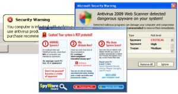

[**مضادات الفيروسات Antivirus المزيفة تحصد ما لا يقل عن 150 مليون دولار من ضحاياها على الانترنت**](https://www.it-scoop.com/2009/12/%d9%85%d8%b6%d8%a7%d8%af%d8%a7%d8%aa-%d8%a7%d9%84%d9%81%d9%8a%d8%b1%d9%88%d8%b3%d8%a7%d8%aa-antivirus-%d8%a7%d9%84%d9%85%d8%b2%d9%8a%d9%81%d8%a9-%d8%aa%d8%ad%d8%b5%d8%af-%d9%85%d8%a7-%d9%84%d8%a7/)

قام الـ Internet Crime Complaint Center  **IC3** التابع للـ FBI بنشر تحذير على موقعه عن مضادات الفيروسات المزيفة التي زاد انتشارها مؤخرا.

تقوم مضادات الفيروسات المزيفة هذه بإظهار إعلانات مزعجة على شاشة المستخدم تخبره  بأن جهازه مصاب و تطلب منه مبلغا ماليا مقابل تحميل برنامج الـ Antivirus الذي يخلصه منه و الذي هو  أصلا عبارة عن برنامج ضار قد يسهل لصاحب البرنامج مهمة جمع المعلومات الحساسة الخاصة بالضحية على غرار أرقام بطاقات الائتمان و الكلمات السرية.

حسب الـ IC3  فإنه لهذه البرامج العديد من الضحايا الذين دفعوا مبالغ مالية مقابل برامج تقوم بسرقة بياناتهم الحساسة ، و تقدر هذه المبالغ المالية التي تم جمعها بهذه الطريقة بأكثر من 150 مليون دولار.

للحد من هذه الظاهر تطلب الـ IC3  من ضحايا هذه البرنامج بتبليغها عنها.

في نفس السياق تشير شركة Symentec  إلى أنها أحصت أكثر من 43 مليون محاولة تنصيب لهذه الـ Antivirus المزيفة خلال سنة 2009 فقط.

تجدر الإشارة إلى أن أصحاب هذه الـ Antivirus المزيفية يسعون لنشر برامجهم بكل الطرق ، إذ ظهر خلال شهر  سبتمبر الماضي على موقع جريدة The New York Times إعلان لـ Antivirus مزيف يوهم زائري الموقع بأن أجهزتهم مصابة و يدعوهم لشراء البرنامج،  و هو الإعلان الذي تم سحبه مباشرة بعد أن تم التأكد من حقيقته.

[المصدر](http://www.ic3.gov/media/2009/091211.aspx)
