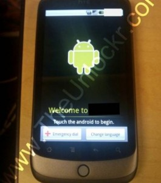

**Google تؤكد وجود جهاز Google Phone**

أعلنت Google على لسان Mario Queiroz أن الـ Smartphone الخاص بها و الذي دارت حوله الشائعات مؤخرا حقيقة و ليس مجرد إشاعة.

لكن من ناحية أخرى تؤكد Google أن هذا الجهاز و المسمى Nexus One  (لم تعلن Google عن هذا الاسم و لكنه يظهر في الـ firmware الخاص بالجهاز) ليس موجها للتسويق و إنما فقط للاستخدام الداخلي لـ Google ، حيث أنها وزعت 300 قطعة من الجهاز الجديد على موظفيها عبر مختلف أنحاء العالم بغرض تجربة آخر تقنياتها فقط.

الجهاز Nexus One المصنع من طرف HTC يمتاز بكل من شاشة كبيرة تعمل باللمس و معالج Snapdragon إضافة إلى تضمينه بنظام تشغيل  Android 2.1.

من ناحية أخرى فإن جريدة Wall Street Journal  تأكد أن Google ستسوق  هذا الجهاز بنفسها  بداية من شهر يناير القادم بدون أية اشتراكات مما قد يجعل شركاء Google أمثال Motorola الذين يصنعون أجهزة Smartphone مجهزة بـ Android في حرج.

[المصدر](http://googlemobile.blogspot.com/2009/12/android-dogfood-diet-for-holidays.html#links)
