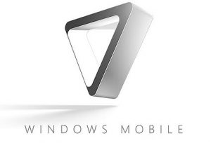

[**Microsoft  تعلن عن تأخير صدور Windows mobile 7  إلى غاية نهاية 2010**](https://www.it-scoop.com/2009/12/microsoft-%d8%aa%d8%b9%d9%84%d9%86-%d8%b9%d9%86-%d8%aa%d8%a3%d8%ae%d9%8a%d8%b1-%d8%b5%d8%af%d9%88%d8%b1-windows-mobile-7-%d8%a5%d9%84%d9%89-%d8%ba%d8%a7%d9%8a%d8%a9-%d9%86%d9%87%d8%a7%d9%8a%d8%a9-20/)

أعلنت Microsoft  أن نظام التشغيل Windows Mobile 7 الموجه للأجهزة الكفية  لن يصدر قبل نهاية العام القادم.

كان من المتوقع صدور Windows Mobile 7 خلال العام القادم لكن تم تأخير صدوره لأسباب لم يتم الإفصاح عنها.

يأتي هذا الإعلان خلال مؤتمر Connect الذي أقيم في العاصمة البريطانية لندن على لسان Phil Moore المسؤول عن الـ mobility في فرع Microsoft في بريطانيا.

بهذا القرار ستجد Microsoft  نفسها بين مطرقة المنافسة الشرسة التي تلاقيها خصوصا من طرف غريمتها Google بنظام تشغيل Android الذي بدأ في الانتشار السريع مؤخرا وسندان عدم تكرار أخطاء  أنظمة تشغيلها السابقة و التي عانت الكثير من المشاكل فيها بسبب التسرع في إطلاقها.

[المصدر](http://www.trustedreviews.com/mobile-phones/news/2009/12/14/Microsoft--Windows-Mobile-7-Delayed-Until-Late-2010/p1)
