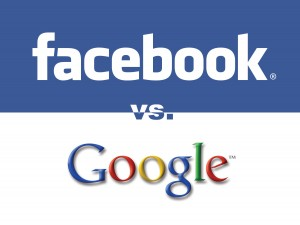

[**و تبدأ حرب الروابط المختصرة بين Google  و Facebook**](https://www.it-scoop.com/2009/12/%d9%88-%d8%aa%d8%a8%d8%af%d8%a3-%d8%ad%d8%b1%d8%a8-%d8%a7%d9%84%d8%b1%d9%88%d8%a7%d8%a8%d8%b7-%d8%a7%d9%84%d9%85%d8%ae%d8%aa%d8%b5%d8%b1%d8%a9-%d8%a8%d9%8a%d9%86-google-%d9%88-facebook/)

أعلنت Google عن إطلاق خدمة جديدة للروابط المختصرة goo.gl   لتحويل الروابط الطويلة إلى روابط قصيرة على شاكلة روابط Bit.ly أو tinyurl.com.

كما أن  Facebook أيضا دخلت معترك الروابط المختصرة دون الإعلان الرسمي عن ذلك من خلال موقعها fb.me، لكن خدمتها تقتصر على صفحات Facebook فقط .

حسب Google فإن خدمتها الجديدة تتميز بأنها ثابتة حيث أن خدمتها تقوم بأدائها على أكمل وجه و آمنة بحيث أنها تتأكد من أن الروابط لا تخص برامج ضارة أو مواقع خبيثة  و سريعة بحيث أن آلية استرجاع الروابط الأصلية جد سريعة.

دخول عملاقين مثل Google و Facebook لمجال الروابط المختصرة قد يسبب مشاكل كبيرة للعديد من المواقع التي تقدم نفس الخدمة حاليا مثل كل من Bit.ly و tinyurl.com حيث أنه من الممكن أن نرى هجرة جماعية من هذه المواقع إلى خدمتي Goo.gl و fb.me (إن أطلقت Facebook  هذه الخدمة لجميع المواقع و ليس لصفحاتها فقط) نظرا  للشعبية الكبيرة التي يحظيان بها.

حاليا لا يمكن استعمال خدمة Google **مباشرة** ،لكنه يبقى ذلك ممكنا من خلال Google Toolbar و خدمة Feedburner .

أما فيما يخص Facebook  فإنه يمكن اختصار رابط ملف أي عضو أو صفحة باستبدال facebook.com بـ fb.me

مثل:fb.me/pages/It-scoopcom-/183670883733 (ليس مختصرا فعلا  و إنما فقط لتوضيح الفكرة :D )

المصادر:

goo.gl موقع خدمة اختصارات Google

fb.me موقع اختصارات facebook
