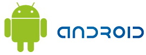

[**عدد التطبيقات على الـ Android Market يتجاوز حاجز الـ 20,000  تطبيق و العدد مرشح للزيادة أكثر**](https://www.it-scoop.com/2009/12/%d8%b9%d8%af%d8%af-%d8%a7%d9%84%d8%aa%d8%b7%d8%a8%d9%8a%d9%82%d8%a7%d8%aa-%d8%b9%d9%84%d9%89-%d8%a7%d9%84%d9%80-android-market-%d9%8a%d8%aa%d8%ac%d8%a7%d9%88%d8%b2-%d8%ad%d8%a7%d8%ac%d8%b2-%d8%a7/)

حسب الإحصائيات المقدمة من طرف AndroLib فإن عدد التطبيقات الحالي على الـ Android Market تجاوز سقف 20,000 تطبيق .

حسب نفس الإحصائيات فإن ثلثا هذا العدد من التطبيقات  مجاني مقابل الثلث فقط على الـ AppStore الخاص بـ Apple الذي يحوي 100.000 تطبيق.

عدد التطبيقات تضاعف في ظرف شهرين فقط مما يوحي بالأهمية التي يوليها المطورون لبرامج نظام تشغيل Android الذي لم يمر على إطلاقه سوى عام واحد.

و يعود الفضل في الاهتمام المتزايد بنظام Android تضاعف الأجهزة الداعمة لهذا النظام إذ دخل إلى حد الآن ثمانية مصنعين سباق تصنيع أجهزة تشغل بـ Android و هم HTC، LG، Samsung، Motorola، Sony Ericsson، Acer و Huawei

و ما سيزيد اهتمام المطورين بلا شك بنظام Android الإطلاق المرتقب لجهاز Nexus One الملقب بـ  Google Phone خلال شهر يناير القادم، إذ تشير التوقعات إلى إمكانية تجاوز عتبة 50,000 تطبيق فقط خلال الفصل الأول من العام القادم.

[المصدر](http://www.androlib.com/appstatsfreepaid.aspx)
