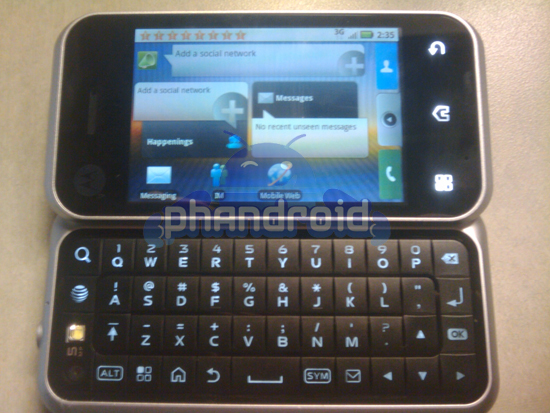

**Motorola تحضرEnzo  ثاني جهاز لها مجهز بنظام Android**

حسب موقع phandroid  فإن Motorla تحضر لإطلاق جهاز جديد يعمل على نظام Android  يحمل اسم Enzo

جهاز Enzo أو Backflip يمتاز بشاشة تعمل باللمس ذات 3,1 بوصة إضافة إلى لوحة مفاتيح كاملة قابلة للدوران للخلف و مجهز بمعالج Qualcomm  ذي تردد528   MHz  إضافة إلى ذاكرة حية تقدر بـ 256 Mb  و ذاكرة داخلية تقدر بـ 512 Mb.

أما  عن الكاميرا الرقمية  فتصل دقة وضوحها إلى 5 megapixels.

أترككم مع بعض الصور:

<!-- more -->

[المصدر](http://phandroid.com/2009/12/16/motorola-backflipenzo-pictures-details/)
