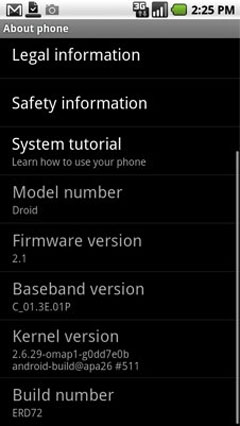

[**الإصدار 2.1 من Android ينصب على أجهزة  Droid**](https://www.it-scoop.com/2009/12/%d8%a7%d9%84%d8%a5%d8%b5%d8%af%d8%a7%d8%b1-2-1-%d9%85%d9%86-android-%d9%8a%d9%86%d8%b5%d8%a8-%d8%b9%d9%84%d9%89-%d8%a3%d8%ac%d9%87%d8%b2%d8%a9-droid/)

قام عضو على منتديات Alldroid المتخصصة في الـ Andoird بتنصيب الإصدار 2.1  من Android المسمى Flan على جهاز Droid  و هو الأمر الذي لم يكن ممكنا منذ بداية تداول هذه الإصدار على المنتديات المتخصصة منذ 15 يوما.

هذا الإصدار و الذي لم يكن من الممكن تنصيبه سوى على أجهزة HTC Hero هو نفسه المثبت على جهاز  Nexus One المعروف بـ Google Phone.

الجديد في هذا الإصدار هو تحسينات على الواجهة و إضافة بعض الـ Widgets  دون أن ننسى إمكانية تنصيب البرامج على الجهاز انطلاقا من جهاز حاسوب.

الفيديو التالية توضح جهاز Droid بعد تنصيب الإصدار 2.1   من Droid  عليه:

<!-- more -->

<object classid="clsid:d27cdb6e-ae6d-11cf-96b8-444553540000" width="425" codebase="http://download.macromedia.com/pub/shockwave/cabs/flash/swflash.cab#version=6,0,40,0" height="344"><embed src="http://www.youtube.com/v/9ypkGi9Hxt4&hl=fr_FR&fs=1&" allowscriptaccess="always" height="344" width="425" allowfullscreen="true" type="application/x-shockwave-flash"></embed></object>

المصدر
