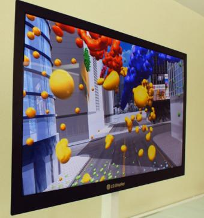

[**LG تكشف عن أرق شاشة LCD في العالم بسمك لا يتجاوز 2,6  ميليمتر**](https://www.it-scoop.com/2009/12/lg-%d8%aa%d9%83%d8%b4%d9%81-%d8%b9%d9%86-%d8%a2%d8%b1%d9%82-%d8%b4%d8%a7%d8%b4%d8%a9-lcd-%d9%81%d9%8a-%d8%a7%d9%84%d8%b9%d8%a7%d9%84%d9%85-%d8%a8%d8%b3%d9%85%d9%83-%d9%84%d8%a7-%d9%8a%d8%aa%d8%ac/)

كشفت LG النقاب عن آخر تحدياتها و المتمثل في شاشة LCD ذات 42 بوصة و  بسمك لا يتجاوز 2,6 ميليمتر.

الشاشة ذات الأربع كيلوغرامات تمتاز بدقة وضوح 1920x1080 على تردد 120  Hz.

من المرتقب أن يتم عرض هذه الشاشة الجديدة خلال مؤتمر Consumer Eletronics Show الذي سيقام في Las Vegas الأمريكية بداية العام القادم. و لم يتم الإعلان بعد عن أي تاريخ لبداية تسويقه.

تجدر الإشارة إلى أن الرقم القياسي السابق كان بحوزة Samsung بفضل شاشتها   Needle Slim ذات 3,9  ميليمتر.

[المصدر](http://lg.co.kr/press/lgnews/news/news_view.jsp?press_no=13752)
