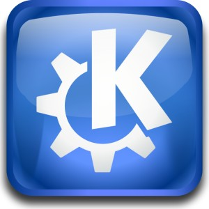

[**صدور الـ Beta الثانية لسطح مكتب KDE SC 4.4**](https://www.it-scoop.com/2009/12/%d8%b5%d8%af%d9%88%d8%b1-%d8%a7%d9%84%d9%80-beta-%d8%a7%d9%84%d8%ab%d8%a7%d9%86%d9%8a%d8%a9-%d9%84%d8%b3%d8%b7%d8%ad-%d9%85%d9%83%d8%aa%d8%a8-kde-sc-4-4/)

أعلن مطورو مشروع KDE عن صدور الـ Beta الثانية لسطح المكتب KDE SC 4.4 و التي تحمل الاسم Claus.

لم تأت هذه الإصدارة بالعديد من المستجدات بقدر ما جاءت بجملة من التصحيحات و بعض التحسينات إضافة إلى جملة من الأعمال التي تخص الثبات.

يمكن ملاحظة كل التغييرات الجديدة من [هنا](http://techbase.kde.org/Schedules/KDE4/4.4_Release_Goals)

كما يمكن الإطلاع على طريقة تنصيب هذه الإصدارة من [هنا](http://kde.org/announcements/announce-4.4-beta2.php)
