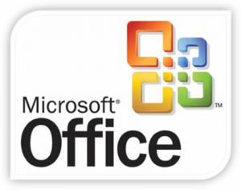

[**Microsoft تخسر قضيتها أمام i4i وتمنع من بيع Word2007 ابتداء من 11 يناير القادم**](https://www.it-scoop.com/2009/12/microsoft-%d8%aa%d8%ae%d8%b3%d8%b1-%d9%82%d8%b6%d9%8a%d8%aa%d9%87%d8%a7-%d8%a3%d9%85%d8%a7%d9%85-i4i-%d9%88%d8%aa%d9%85%d9%86%d8%b9-%d9%85%d9%86-%d8%a8%d9%8a%d8%b9-word2007-%d8%a7%d8%a8%d8%aa%d8%af/)

خسرت Microsoft استئنافها للقضية التي رفعتها ضدها الشركة الكندية i4i و المتعلقة بخرق لحقوق الملكية الفكرية الخاصة بها، و يتوجب عليها دفع 290 مليون دولار لغريمتها.

القضية رفعتها i4i ضد Microsoft متهمة إياها باستعمال تقنية خاصة بملفات XML في برنامج Word 2003 و 2007 و التي تملك براءة اختراع مسجلة باسهما.

من بين الأدلة التي قدمتها i4i بريد إليكتروني داخلي لـ Microsoft يبين علم موظفي Microsoft بوجود براءة الاختراع ، مما يعني –حسب i4i – أن Microsoft تعمدت خرق حقوقها.

من ناحيتها فقد قللت Microsoft من شأن القضية حيث قالت على لسان Kevin Kutz مدير العلاقات العامة  أن Microsoft ستمثل لأمر المحكمة ، لكنه يشير إلى أن الحكم لا يشمل النسخ التي سيتم بيعها إلى غاية  11 يناير، إضافة إلى أن Microsoft تعمل على توفير نسخ من Word2007 لا تحتوي على الخاصية المتنازع عليها.

تجدر الإشارة إلى أن إصدارات Office 2010 Beta لا تحتوي على هذه الخاصية التي تصفها Microsoft بأنها قليلة الاستعمال.

[المصدر](http://blog.seattlepi.com/microsoft/archives/188986.asp?source=mypi)
