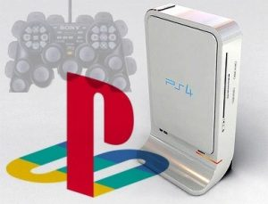

[**Sony تحضر الجيل الرابع من PlayStation**](https://www.it-scoop.com/2009/12/sony-%d8%aa%d8%ad%d8%b6%d8%b1-%d8%a7%d9%84%d8%ac%d9%8a%d9%84-%d8%a7%d9%84%d8%b1%d8%a7%d8%a8%d8%b9-%d9%85%d9%86-playstation/)

بدأ العملاق الياباني Sony رحلة العمل على الجيل الجديد من منصة الألعاب Playstation.

المعلومات  الأولية  تشير إلى أن  الإصدار الرابع من PlayStation  سيتبنى نظام المعالجات متعددة الأنوية ، والتي ستكون خرائط البنية الهندسية لها مختلفة عن جهازها السابق  ، والذي لا زال يمثل صعوبة كبيرة جداً لمطوري الألعاب ، وتحاول Sony  حاليا إيجاد حلول  لهذه المشكلة.

و تشير بعض المصادر إلى إمكانية استعانة Sony بمعالجات مصنعة من طرف Intel

الجدير بالذكر أن كلا من شركتي Microsoft و Nintendo تبحثان هما أيضا عن معالجات جديدة لأجهزتهما القادمة

[المصدر](http://www.techradar.com/news/gaming/sony-playstation-4-set-to-get-multi-core-cpu-660439)

ترى كيف ستكون صور ألعاب الجيل القادم من تلك الأجهزة؟
