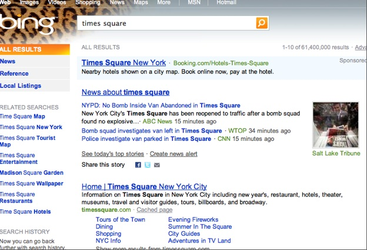

[**و أخيرا فعلها Bing و تفوق على Google و لو لمرة واحدة**](https://www.it-scoop.com/2009/12/%d9%88-%d8%a3%d8%ae%d9%8a%d8%b1%d8%a7-%d9%81%d8%b9%d9%84%d9%87%d8%a7-bing-%d9%88-%d8%aa%d9%81%d9%88%d9%82-%d8%b9%d9%84%d9%89-google-%d9%88-%d9%84%d9%88-%d9%84%d9%85%d8%b1%d8%a9-%d9%88%d8%a7%d8%ad/)

استطاع محرك Bing أن يثبت قوته و جدارته بمنافسة Google و ذلك خلال حادثة الإبلاغ  الكاذب عن وجود قنبلة في الـ Times Square قبل يومين.

إذ أنه تم إخلاء الـTimes Square  لبعض الوقت أول أمس  بعد ورود خبر كاذب عن وجود قنبلة في إحدى السيارات المتوقفة هناك ، مما دفع الناس لاستعمال محركات البحث لمعرفة المزيد من تطورات القضية.

نتائج البحث عن “Times Square” في كلا المحركين كانت مختلفة، فقد أشارت نتائج Google إلى تحضيرات احتفاليات رأس السنة في المنطقة ، بينما أشارت نتائج بحث Bing إلى الأخبار اللحظية عن البلاغ الكاذب.

ويتبين أن bing قد هزم الكبير google في نقل أخبار هذا الحدث.

[المصدر](http://www.techcrunch.com/2009/12/30/realtime-search-off-bing-beats-google/)

-  فهل سيكون بلاغ كاذب عن قنبلة هو بداية تفوق Bing على Google ؟
