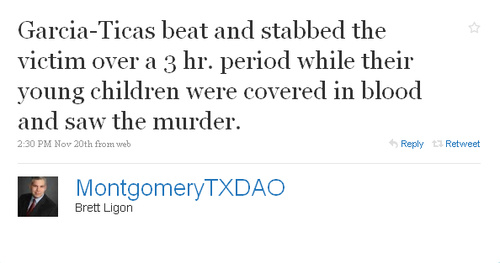

[**شرطة تكساس تستخدم Twitter للتشهير بأسماء المخالفين!**](https://www.it-scoop.com/2010/01/%d8%b4%d8%b1%d8%b7%d8%a9-texas-%d8%aa%d8%b3%d8%aa%d8%ae%d8%af%d9%85-twitter-%d9%84%d9%84%d8%aa%d8%b4%d9%87%d9%8a%d8%b1-%d8%a8%d8%a3%d8%b3%d9%85%d8%a7%d8%a1-%d8%a7%d9%84%d9%85%d8%ae%d8%a7%d9%84%d9%81/)

يوما بعد يوم  تزيد استخدامات خدمة التدوين المصغر Twitter  من قبل الجميع!

الآن تقوم ولاية Texasبالتشهير بأسماء السائقين المخمورين على موقع Twitter، وتقصد بذلك إحراجهم كعقوبة إضافية لئلا يتكرر منهم هذا الفعل.

الملفت للانتباه و الداعي إلى السخرية في آن واحد هو قيام هؤلاء السائقين باستخدام Twitter أيضاً ليخبر بعضهم بعضا بأماكن دوريات الشرطة ليتم تجنبها!

[المصدر](http://gizmodo.com/5434383/texas-county-shames-drunk-drivers-on-twitter)

-   ماهو رأيك في مثل هذه العقوبات الجديدة والحديثة و استعمال نفس التقنية لأغراض متناقضة!!!؟؟؟

-   ومتى ستقوم  الدول العربية بتبني مثل هذا النوع من العقوبات البسيطة والفعالة؟
