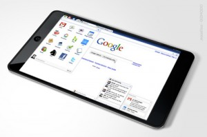

[**المنافسة تشتد !!!  Google و HTC تحضران لإطلاق جهازهما اللوحي**](https://www.it-scoop.com/2010/01/%d8%a7%d9%84%d9%85%d9%86%d8%a7%d9%81%d8%b3%d8%a9-%d8%aa%d8%b4%d8%aa%d8%af-google-%d9%88-htc-%d8%aa%d8%ad%d8%b6%d8%b1%d8%a7%d9%86-%d9%84%d8%a5%d8%b7%d9%84%d8%a7%d9%82-%d8%ac%d9%87%d8%a7%d8%b2/)

على الرغم من أنه لم يصدر بعد جهاز  Apple اللوحي حتى الآن ، إلا أنه تسربت أخبار أن العملاق Google يعتزم التحضير لجهاز لوحي على غرار جهاز Apple (المرتقب تسميته iSlate)

لا تزال هذه المعلومات غير مؤكدة (بالرغم من منطقيتها).

الجدير بالذكر أن هذا سيتم بالتعاون مع شركة HTC المصنع لجهاز Google المعروف بNexus One.

[المصدر](http://mashable.com/2010/01/02/google-tablet/)

-   يا ترى هل سيكون الجهاز الذي تنوي Google إطلاقه بجودة جهاز Apple (الذي لم يصدر بعد)؟

-   لننتظر Nexus One أولا ونرى ذلك...
