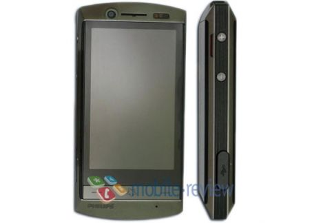

[**Philips تطلق D908 المجهز بـ Windows Mobile 6.5**](https://www.it-scoop.com/2010/01/philips-%d8%aa%d8%b7%d9%84%d9%82-d908-%d8%a7%d9%84%d9%85%d8%ac%d9%87%d8%b2-%d8%a8%d9%80-windows-mobile-6-5/)

أطلقت Philips جهاز Smarthpone جديد تحت مسمى D908 في السوق الصينية و المجهز بنظام Windows Mobile 6.5.

الجهاز الجديد ذو الأبعاد 10.8 x 5.6 x 1.4  سم  يمتلك شاشة ذات 3.2 بوصة تعمل باللمس و الذي يتميز بدقة شاشة 480 x 800 .

نجد أيضا من بين الخصائص التي يمتاز بها هذا الـ Smartphone  كل من كاميرا رقمية ذات دقة 5 Megapixel ، دعم الـ GSM ، الـ Wi-Fi و الـ Bluetooth إضافة إلى القدرة التخزينية التي يمكن أن تصل إلى غاية 32 Gb.

دون أن ننسى البطارية المصنوعة من الـ Lithium-Polymer التي يمكن أن تبقي الجهاز مشتغلا لمدة 240 ساعة في حالة الخمول.

يمكن الإطلاع على قائمة كل خصائص جهاز Philips  D908 من [هنا](http://www.geekwithlaptop.com/philips-d908-mobile-phone)

- هل ما يزال نظام Windows Mobile يستهوي المستخدمين حتى تستخدمه Philips على جهازها الجديد؟

- و لماذا في رأيك لم تفكر Philips باستخدام نظام تشغيل Android الذي يعتبر الموضة الحالية على أجهزة الـ Smartphone ؟
