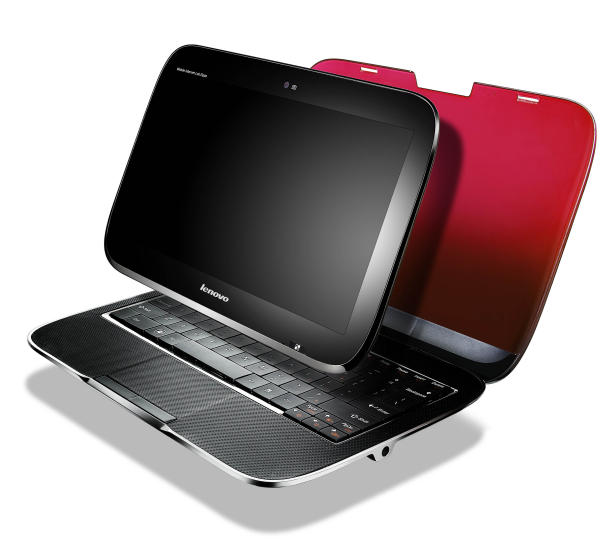

[**شركة Lenovo ستطرح كمبيوتر محمول هجين!!!**](#)

نعم هجين!!! هذا ما قلناه و قصدناه بالضبط :) !!

ستطرح شركة Lenovo جهازها الهجين والمسمى IdeaPad U1 Hybrid ، والذي سيتمكن المستخدم من استعماله كجهاز Laptop عادي ، أو إذا رغب يمكنه ببساطه فك الشاشة واستعماله كـLaptop  يعمل بتقنية اللمس !
](IdeaPad_Hybrid_05_copy_610x543.jpg)

. يتميز هذا الجهاز بشاشة ذات قياس 11.6 بوصة ، ومعالج من Intel ، مع تكلفة تقديرية ب999 دولار! ، وتأمل الشركة بأنه يكون هذا الجهاز  منافسة العديد من الأجهزة التي ستطرح مثل الجهاز اللوحي لـ Apple و المتوقع تسميته  Apple islat

لم تذكر الشركة بعد العديد من المعلومات التقنية عنه ، حيث سيزاح الستار عن كامل المعلومات في معرض CES 2010 القادم

ونحن سنترقب ذلك إن شاء الله

[المصدر](http://ces.cnet.com/8301-31045_1-10424800-269.html)

- هل تتوقعون أن يكون الجهاز منافس للعديد من الأجهزة القادمة من عملاقة مثل Apple و Google ؟؟
