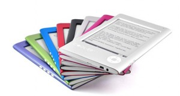

[**Interead تعلن عن إطلاق نماذج جديدة من قارئ الكتب الالكترونية COOL-ER Ereader **](https://www.it-scoop.com/2010/01/interead-%d8%aa%d8%b9%d9%84%d9%86-%d8%b9%d9%86-%d8%a5%d8%b7%d9%84%d8%a7%d9%82-%d9%86%d9%85%d8%a7%d8%b0%d8%ac-%d8%ac%d8%af%d9%8a%d8%af%d8%a9-%d9%85%d9%86-%d9%82%d8%a7%d8%b1%d8%a6-%d8%a7%d9%84%d9%83/)

تناولنا في أخبار سابقة أن سوق القارئات الإلكترونية سيشتعل و سيشهد منافسة حامية الوطيس. فلم يمض إلا القليل من الوقت حتى بدأنا نشهد حمى الإنتاج و الاستثمار في مجال القارئات الإلكترونية و ها هي شركة  Interead  تأكذ ذلك بإعلانها قبل إنطلاق مؤتمر ces2010 عن إطلاق سلسلة  نماذج جديدة من  COOL-ER Ereader.

هذه السلسلة ذات المميزات تقنية و الجمالية الفريدة من نوعها و التي تعتزم خوض  غمار المنافسة بها. حيث صرحت شركة Interead أن منتوجها قادرعلى استيعاب أي لغة في الكون إذ أنه  يدعم كلا من الإنجليزية و الفرنسية و الإسبانية و الإيطالية و لا ندري بعد إن تم أخذ العربية بعين الاعتبار أم لا و إن كان أغلب الظن أنها هي أيض مدعومة .
هذه القارئات الجديدة  علاوة على أنها متألقة بألوانها الزاهية فإنها تعتمد على معالج Samsung S3C2440 ARM 400MHz  و مساحة تخزين قدرها 1GB . و تشتغل على نظام  Linux  . كما تعتمد على 6 شاشات حبرية E Ink screen  و تدعم بطاقة تخزين خارجية sd cart حتى 6GB.

إضافة إلى نموذج آخر يبلغ وزنه 164 غرام يتمتع بميزة اتصال WiFi و شاشات باللمس كما أضيفت ميزة الاتصال من الجيل الثالث 3G لإبقاء المستخدم متصلا أينما كان و حيثما وجد . و من المخطط بداية بيعها في الربيع القادم

[المصدر](http://www.prnewswire.com/news-releases/interead-announces-new-cool-er-ereader-models-80617737.html)

- بهذه المواصفات هل تفضل شراء جهاز Kindle أم جهاز  COOL-ER Ereader ؟
