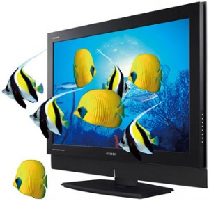

[**Samsung و RealD:  فريق واحد من أجل أجهزة تلفزيون ثلاثية الابعاد**](https://www.it-scoop.com/2010/01/samsung-%d9%88-reald-%d9%81%d8%b1%d9%8a%d9%82-%d9%88%d8%a7%d8%ad%d8%af-%d9%85%d9%86-%d8%a3%d8%ac%d9%84-%d8%a3%d8%ac%d9%87%d8%b2%d8%a9-%d8%aa%d9%84%d9%81%d8%b2%d9%8a%d9%88%d9%86-%d8%ab%d9%84%d8%a7/)

أعلنت شركة الإلكترونيات العملاقة Samsung عن عقد شراكة مع  نظيرتها شركة Real D للاستفادة من تقنياتها ثلاثية الأبعاد 3D لاستخدامها في تلفزيوناتها ثلاثية الأبعاد مستقبلا,

شركة RealD التي تتنافس مع مختبرات Dolby على سوق السينما ستتعاون مع Samsung لتطوير النظارات المستخدمة لمشاهدة الافلام ثلاثية الأبعاد كما سيتم التعاون على على توفير بديل لتكنولوجيا العرض السلبي passive display technology, التي تتطلب نظارات استقطاب سلبية لاستقبال صور ثلاثية الأبعاد 3d.
و على هامش اتفاق الشراكة صرح  Dongho نائب رئيس قسم العرض في شركة Samsung .

<blockquote>"نحن ملتزمون بتعزيز تجربة مشاهدة التلفزيون مع أفضل ما يمكن أن تقدمه تكنولوجيا 3D بما في ذلك عمق حي للمغامرة و عالم جديد من الالوان "</blockquote>

[المصدر](http://www.pcmag.com/article2/0,2817,2357636,00.asp)

- ما رأيك في مثل هذه التقنيات؟

- و هل يأتي اليوم الذي ستصبح فيه الشاشات ثلاثية الأبعاد هي الأساس و ليس الشاشات العادية الحالية؟
