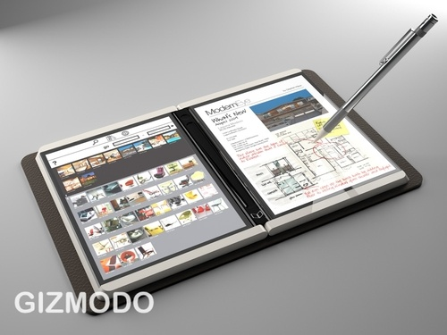

[**جهاز لوحي شبيه بالـ iSlate لكن هذه المرة من HP و Microsoft**](https://www.it-scoop.com/2010/01/%d8%ac%d9%87%d8%a7%d8%b2-%d9%84%d9%88%d8%ad%d9%8a-%d8%b4%d8%a8%d9%8a%d9%87-%d8%a8%d8%a7%d9%84%d9%80-islate-%d9%84%d9%83%d9%86-%d9%87%d8%b0%d9%87-%d8%a7%d9%84%d9%85%d8%b1%d8%a9-%d9%85%d9%86-hp-%d9%88-m/)

وفقا لصحيفة New york Times فإن Steve Ballmer الرئيس التنفيذي لشركة Microsoft  قد لمح في أخر تصريح منسوب إليه  أنه سيعرض جهازا لوحيا يعمل باللمس مصنع من طرف HP لصالح Microsoft مثل الجهاز اللوحي الخاص بـ Apple و المسمى islate في معرض ces2010

و توقع Ballmer أن يكون الجهاز اللوحي متاحا للبيع منتصف هذه السنة  .و تجدر الإشارة إلى أن المتحدثين الرسميين لكل من  Microsoft  وHP امتنعوا عن التعليق على المنتج  أو مضمون خطاب Ballmer.
على كل حال كانت هناك شائعات ، وحتى صور وهمية  عن الجهاز  و تم تعميم  صور النموذج على مدى الشهور القليلة الماضية .

موقع  الاخبار الشهير Gizmodo أبلغ عن وجود منتج لـ microsoft  شبيه لـ islate الذي أثار زوبعة من الأخبار و الشائعات مؤخرا.
وذكرت صحيفة New York Times  أن مصادرها و التي  ترد الإفصاح عنها قد أشارت إلى   أن Ballmer أسر لبعض أصدقائه أن المنتج  الذي لم يطلق عليه أي اسم بعد  سيكون متعدد الوسائط مع عدة وظائف  واتصال متعدد و يشتغل باللمس.

[المصدر](http://www.digitaltrends.com/gadgets/ballmer-to-reveal-microsofthp-slate-device-during-keynote-speech/)

هل ستكون سنة 2010 سنة الأجهزة اللوحية ؟
