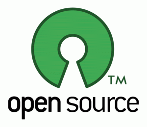

[**الأردن تتجه إلى عالم المصادر المفتوحة بقوة**](https://www.it-scoop.com/2010/01/%d8%a7%d9%84%d8%a3%d8%b1%d8%af%d9%86-%d8%aa%d8%aa%d8%ac%d9%87-%d8%a5%d9%84%d9%89-%d8%b9%d8%a7%d9%84%d9%85-%d8%a7%d9%84%d9%85%d8%b5%d8%a7%d8%af%d8%b1-%d8%a7%d9%84%d9%85%d9%81%d8%aa%d9%88%d8%ad%d8%a9/)

وقعت الحكومة الأردنية اتفاقا مع Ingres Corporation   المختصة في قواعد البيانات مفتوحة المصدر ، تأمل من خلاله أن تطور إمكانياتها في مجال المصادر المفتوحة و أن تصبح الرائدة فيه في الشرق الأوسط.

ينص الاتفاق المبرم بين الطرفين بتزويد الحكومة الأردنية باحتياجاتها من البرامج مفتوحة المصدر، و بتدريب موظفيها على استخدامها ، و بتحسيس الطلبة و تشجيعهم على  المساهمة في مشاريع مفتوحة المصدر.

[المصدر](http://www.eweekeurope.co.uk/news/jordan-signs-deal-with-open-source-database-specialist-3011)

هل تتوقع النجاح لمثل هذه العملية؟

و هل تظن أننا سنرى نفس العملية في بلدان عربية أخرى ؟
