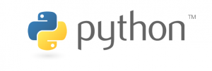

[**إطلاق الإصدار Alpha1 من Python 2.7**](https://www.it-scoop.com/2010/01/%d8%a5%d8%b7%d9%84%d8%a7%d9%82-%d8%a7%d9%84%d8%a5%d8%b5%d8%af%d8%a7%d8%b1-alpha1-%d9%85%d9%86-python-2-7/)

أطلقت الـ Python Software Foundation الإصدار Alpha1 من Python 2.7 و التي من المتوقع أن تتبعها عدة إصدارات تجريبة أخرى قبل إطلاق الإصدار النهائي منها خلال شهر يونيو القادم.

سيكون الإصدار 2.7 آخر إصدار ستعرفه Python 2.x، إذ أنه سيتم التفرغ كلية لـ Python 3.x  و الذي لا يعتبر متوافقا مع عائلة إصدارات Python 2.x، إذ أنه حسب Guido van Rossum مؤسس لغة Python ، لم تتم مواصلة العمل على سلسة Python2.x إلا لعدم إجبار مبرمجي Python على الانتقال الإجباري إلى Python 3.x.

الجديد في هذا الإصدار هو تضمين العديد من الوظائف الخاصة بـ Python 3.1 مما يسمح للمبرمجين الانتقال السلس إلى Python 3.x

يمكن تحميل Python 2.7 من [هنا](http://www.python.org/download/releases/2.7/)
