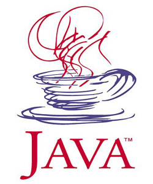

[**إطلاق التحديث الثامن عشر لـ Java SE 6**](https://www.it-scoop.com/2010/01/%d8%a5%d8%b7%d9%84%d8%a7%d9%82-%d8%a7%d9%84%d8%aa%d8%ad%d8%af%d9%8a%d8%ab-%d8%a7%d9%84%d8%ab%d8%a7%d9%85%d9%86-%d8%b9%d8%b4%d8%b1-%d9%84%d9%80-java-se-6/)

أطلقت Sun التحديث الثامن عشر لـ Java SE 6 و الذي يحوي تصحيحا لـ 300  على تم اكتشافها منذ التحديث الأخير خلال شهر نوفمبر الفارط.

الملاحظ في هذا التحديث هو خلوه من أية ترقيعات تخص الأمن و الحماية ، على غير عادة التحديثات السابقة، إذ أنه تم التركيز هذه المرة على الأداء أكثر، فمثلا يسمح هذا الإصدار الأخير بتشغيل الـ Applets 15%  أسرع مما كانت عليه سابقا.

أمر آخر و هو التمكين من قراءة ملفات ZIP يصل حجمها إلى غاية 4 Gb  مقابل 2 Gb فيما سبق.

دون أن ننسى مجموعة من التحسينات التي مست  الـ Heap الخاص بالبرامج و الـ garbage collector.

تجدر الإشارة إلى أن Sun صارت تفصل بين التحديثات الأمنية و التحديثات الخاصة بالأداء، مما يسمح للشركات التي تستعمل الـ Java، بالتسريع بعمل التحديثات الخاصة بالأمن ، و التريث فيما سواها إن كانت لا ترى أية فائدة ترجع عليها في ذلك.

يمكن تحميل الـ Java SE 6 Update 18 من [هنا](http://java.sun.com/javase/downloads/widget/jdk6.jsp)

- هل تظن أنه بقيت هناك أية حظوظ لـ Java لمنافسة الـ Dotnet خاصة بعد التقدم الكبير الذي عرفته هذه الأخيرة، و المشاكل التي تعاني منها Sun بعد عملية بيعها ؟
