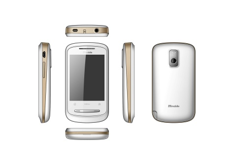

[**ZTE الصيني يعلن رغبته إطلاق هواتف تعمل بنظام Android قريبا**](https://www.it-scoop.com/2010/01/zte-%d8%a7%d9%84%d8%b5%d9%8a%d9%86%d9%8a-%d9%8a%d8%b9%d9%84%d9%86-%d8%b1%d8%ba%d8%a8%d8%aa%d9%87-%d8%a5%d8%b7%d9%84%d8%a7%d9%82-%d9%87%d9%88%d8%a7%d8%aa%d9%81-%d8%aa%d8%b9%d9%85%d9%84-%d8%a8%d9%86/)

بعد كل من Lenovo و Huawei ، يستعد ثالث عملاق صيني و المتمثل فيZTE  بإطلاق هواتف تعمل بنظام Android بعد انضمامه إلى الـ Open Handset Alliance و التي تضم شركاء Goolge من المصنعين.

حسب Lin Qiang الذي يشغل منصب General Manager الخاص بالـ Smartphone لدى ZTE :

<blockquote>التنامي المستمر و ازدياد شعبية Android المتزايدة دفعنا إلى الاستثمار في هذا النظام الرائع، و الذي يساعدنا على الاستجابة لمتطلبات السوق الحالية. من أجل هذا أقدمنا على التطوير و البحث فيما يخص هذا النظام خلال العام الماضي، مما سيسهل علينا إطلاق هواتف تعمل بنظام Android خلال الثلث الأول من العام الحالي.</blockquote>

من المرتقب إطلاق أولى نماذج هواتف ZTE المجهزة بنظام Android خلال الـ Mobile World Congress المزمع عقده في برشلونة الإسبانية ابتداءً من النصف الثاني من فبراير القادم.

كما أن المصنع الصيني ZTE قام بالكشف عن صور لأحد أجهزته القادمة دون أن يعطي أي تفاصيل تقنية عنه (انظر إلى الصورة أعلاه).

[المصدر](http://www.techtree.com/India/News/ZTE_Plans_Android_Smartphones_Joins_OHA/551-108774-893.html)

- كيف تتوقعون ردة فعل Microsoft  و التي طال زمن انتظار نظام تشغيلها Windows Mobile 7 طويلا ؟
