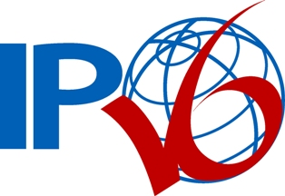

[**بقاء 10% فقط من عناوين IPv4 و  احتمال نفادها جميعا خلال العام القادم**](https://www.it-scoop.com/2010/01/%d8%a8%d9%82%d8%a7%d8%a1-10-%d9%81%d9%82%d8%b7-%d9%85%d9%86-%d8%b9%d9%86%d8%a7%d9%88%d9%8a%d9%86-ipv4-%d9%88-%d8%a7%d8%ad%d8%aa%d9%85%d8%a7%d9%84-%d9%86%d9%81%d8%a7%d8%af%d9%87%d8%a7-%d8%ac%d9%85/)

إذا صدقت الدراسة التي نشرتها Number Resource Organization، فإنه لم يتبقى سوى 10% من عناوين IPv4 متاحة للاستعمال.

و تضيف إلى أن  نفاد هذا العدد المتبقي متوقع خلال العام القادم 2011.

و تدعو الـ NRO من خلال دراستها هذه الحكومات و مزودي الإنترنت و الشركات و جميع المستخدمين إلى ضرورة الانتقال إلى IPv6 في أقرب الآجال، و إن لم يتم ذلك ، فإنه حسب هذه الدراسة من المتوقع أن نشاهد توقف ظهور مواقع جديدة و مستخدمين جدد للإنترنت خلال العام القادم.

للتذكير فإن عناوين IPv4 تأتي على شكل xx.xx.xx.xx مما يعني استعمالها لـ 8 أرقام ست عشرية Hexadecimal  و هذا يعني استعمال  32  بت  لأنه كل رقم ست عشري يتكون من 4 بت  مما يجعل عدد العناوين الكلي هو 2 ^32 = 4294967296 أي أكثر من أربعة ملايير عنوان

في حين أن عناوين IPv6 تستعمل 16 رقما عشريا أي 128 بت  و هذا ما يعطينا 2 ^32 2 ^128... استعمل الآلة الحاسبة لترى الرقم الضخم :)

[المصدر](http://www.nro.net/media/less-than-10-percent-ipv4-addresses-remain-unallocated.html)

- كيف تعلق على هذه الوضعية؟

- و هل سنشهد فعلا عاما دون مواقع جديدة على الإنترنت ؟
