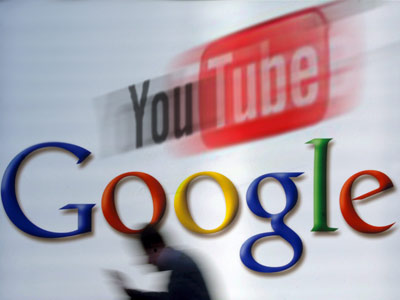

[**Youtube تبدأ استعمال الـ HTML5**](https://www.it-scoop.com/2010/01/youtube-%d8%aa%d8%a8%d8%af%d8%a3-%d8%a7%d8%b3%d8%aa%d8%b9%d9%85%d8%a7%d9%84-%d8%a7%d9%84%d9%80-html5/)

بدأت Youtube في استعمال آخر إصدار من لغة HTML5 ، حيث يسمح لها ذلك بعرض الفيديوهات دون الحاجة إلى استعمال تقنيات الـ Flash لذلك.

هذا الأمر يعطي الانطباع أن Google من خلال خدمة Youtube تعلن رغبتها التخلص من صيغ الملفات المملوكة و على رأسها الـ Flash ، لكن الظاهر أنها وقعت في مشكل آخر، فالتقنية التي بدأت Youtube في استعمالها تحتاج إلى Codec خاص يحمل اسم H.264 و هو الـ Codec غير المدعوم من كل من Firefox و Opera.

حتى Internet Explorer ليس قادرا على استظهار الفيديوهات التي تستعمل تقنيات HTML5 لكن هذه المرة ليس بسبب مشكل الـ Codec و إنما لأنه لا يدعم HTML5 إطلاقا.

الظاهر أن الحل الوحيد للخروج من هذا الحرج هو توفير أكثر نوع من الـ Codec التي يمكن استخدامها على جميع المتصفحات، فمثلا يمكن توفير H.264 لكل من Safari و Chrome، Ogg Theora للـ Firefox و الـ Flash للـ Internet Explorer.

[المصدر](http://www.youtube.com/testtube)

-   هل تظنون أن استعمال Youtube لتقنيات HTML5 هو مسمار آخر يدق في نعش الـ Flash و الذي أصبح مهددا ليس فقط من طرف منافسيه، و إنما أيضا من إمكانية تعميم الـ HTML5 ؟

- و هل تظن أن Youtube ستوفر أنواعا أخرى من الـ Codec أم ستجبر باقي المتصفحات على اتباعها ؟
