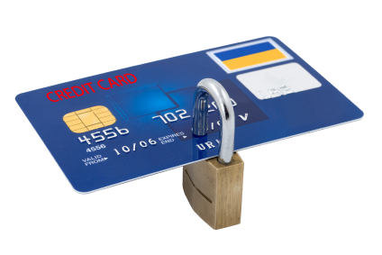

[**باحثون في جامعة Cambridge يكتشفون ثغرة أمنية في البطاقات البنكية**](https://www.it-scoop.com/2010/01/%d8%a8%d8%a7%d8%ad%d8%ab%d9%88%d9%86-%d9%81%d9%8a-%d8%ac%d8%a7%d9%85%d8%b9%d8%a9-cambridge-%d9%8a%d9%83%d8%aa%d8%b4%d9%81%d9%88%d9%86-%d8%ab%d8%ba%d8%b1%d8%a9-%d8%a3%d9%85%d9%86%d9%8a%d8%a9-%d9%81/)

أعلن Ross Anderson الذي يرأس فريقا للبحث في جامعة Cambridge العريقة ، عن إبلاغه للمؤسسات البنكية الأوروبية اكتشافهم لثغرة أمنية في البطاقات البنكية تسمح بتأكيد عملية دفع مبالغ مالية منها دون استعمال الرقم السري للبطاقة.

حسب Anderson  فإن استغلال هذه الثغرة ممكن لكنه ليس سهلا، إذ أنه يجب على منفذها امتلاك البطاقة البنكية التي يود استخراج المال منها، إضافة إلى امتلاكه للمعدات اللازمة لاستغلال الثغرة، مما يقلل من أهمية و إمكانية انتشار استغلال الثغرة على نطاق واسع، و هذا يعطي الانطباع أن استغلال الثغرة لا يزال في ثوبه الأكاديمي فقط.

أمر آخر يجعل استغلال الثغرة أكثر صعوبة و هو إمكانية استغلالها فقط على أجهزة الدفع، مما يجعل كل من أجهزة سحب الأموال و عمليات تحويل الأموال على الإنترنت في منأى عنها .

من ناحيتها، أعلنت عدة بنوك أوروبية عن أخذها الثغرة على محمل الجد، إذ أنها بدأت في دراسة إمكانية استغلال الثغرة و بحث طرق الحماية منها.

يمكن الإطلاع على الدراسة التي نشرها  Anderson من [هنا](http://www.cl.cam.ac.uk/%7Erja14/#Reliability)
