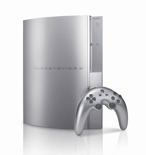

[**قرصنة منصة الألعاب الأكثر شهرة PlayStation3**](https://www.it-scoop.com/2010/01/%d9%82%d8%b1%d8%b5%d9%86%d8%a9-%d9%85%d9%86%d8%b5%d8%a9-%d8%a7%d9%84%d8%a3%d9%84%d8%b9%d8%a7%d8%a8-%d8%a7%d9%84%d8%a3%d9%83%d8%ab%d8%b1-%d8%b4%d9%87%d8%b1%d8%a9-playstation3/)

ادعى أحد القراصنة بأنه استطاع اختراق إحدى أكثر منصات الألعاب شهرة و مبيعا PlayStation3 من شركة Sony .

هذا و قد أكد موقع engadget  صحة الادعاء حيث أورد أن أحد الـ Hacker المعروفين على الساحة الـ "آيفونية" و الذي يعرف باسم George Hotz قام بعملية كسر نظام حماية  المنصة PlayStation 3  و هو الأمر الذي  لم يحدث من قبل منذ أكثر من ثلاث سنوات إلا في حدود و استثناءات بسيطة فقط لكن ما حصل معه كما يدعي أنه تمكن من التحكم في  ذاكرة النظام و السيطرة على المعالج بصفة كاملة و يملك إمكانية تغيير بعض المدخلات (القراءة و الكتابة).

الاستغلال لم ينتشر بعد لكن Sony بإمكانها أن تجعل الأمر أكثر صعوبة إذا ما قررت تحديث الأجهزة  قبل أن يتم نشر الاستغلال و إلى ذلك الحين نحن في انتظار ما سيحصل .

[المصدر](http://www.engadget.com/2010/01/23/ps3-finally-properly-hacked/)

- ما هي التطبيقات التي تتمنى لو يتم استغلال هذه الثغرة لتنفيذها على أجهزة الـ PS3 ؟
