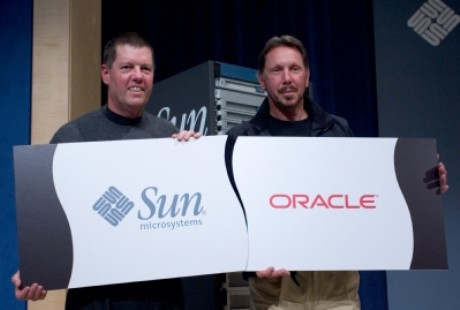

[**بعد الاتحاد الأوروبي، الصين و روسيا قد يوقفان صفقة شراء Oracle لـ Sun**](https://www.it-scoop.com/2010/01/%d8%a8%d8%b9%d8%af-%d8%a7%d9%84%d8%a7%d8%aa%d8%ad%d8%a7%d8%af-%d8%a7%d9%84%d8%a3%d9%88%d8%b1%d9%88%d8%a8%d9%8a%d8%8c-%d8%a7%d9%84%d8%b5%d9%8a%d9%86-%d9%88-%d8%b1%d9%88%d8%b3%d9%8a%d8%a7-%d9%82%d8%af/)

الظاهر أن Oracle لن تهنأ قريبا بشرائها لـ Sun حتى بعد أن أعطت المفوضية الأوروبية ضوءها الأخضر، حيث ستقوم كل من وزارة التجارة الصينية و Federal Antimonopoly الروسية بدراسة ملف الصفقة لإبداء رأيهما فيه.

رحب Michael Widenius مؤسس شركة MySql AB  و مطور MySql بهذين القرارين  حيث علق آمالاً عريضة على إمكانية إيقاف أحداهما أو كلتاهما لصفقة الشراء هذه، حيث صرح لوكالة Reuters قائلا:

<blockquote>الصين و روسيا بلدان قويان و واثقان من نفسيهما، و هما من أنصار المصادر المفتوحة، و لديهما الحق و إمكانية القيام بعمل أفضل مما قامت به المفوضية الأوروبية.</blockquote>

الوضع الحالي يترك خيارين لا ثالث لهما لـ Oracle : إما إتمام الصفقة دون الالتفات إلى ما ستسفر عليه دراسة كلا البلدين و هذا ما يضطرها إلى العمل في جماع أنحاء العالم دونهما ، أو الانتظار مرة أخرى لضمان العمل في هذه البلدين إن كان قراراهما  في صالحها و هو أمر مستبعد نسبيا ، خاصة إذا عملنا أن Oracle أبدت انزعاجا كبيرا من معارضة الاتحاد الأوروبي للصفقة بادئ الأمر.

[المصدر](http://www.reuters.com/article/idUSTRE60G1Z120100117)

-   ما هي الخطوة التي تتوقعها من Oracle و هل سترضخ للمطالب الرامية لتخليص Mysql من بين يديها؟

اقرأ أيضا:

[المفوضية الأوروبية تعطي الضوء الأخضر لعملية  شراء Oracle لـ Sun](../2010/01/%d8%a7%d9%84%d9%85%d9%81%d9%88%d8%b6%d9%8a%d8%a9-%d8%a7%d9%84%d8%a3%d9%88%d8%b1%d9%88%d8%a8%d9%8a%d8%a9-%d8%aa%d8%b9%d8%b7%d9%8a-%d8%a7%d9%84%d8%b6%d9%88%d8%a1-%d8%a7%d9%84%d8%a3%d8%ae%d8%b6%d8%b1/)

[إطلاق MariaDB 5.1 المشابه و المنافس لـ MySql ذو  4 storage engine](../2010/01/%d8%a5%d8%b7%d9%84%d8%a7%d9%82-mariadb-5-1-%d8%a7%d9%84%d9%85%d8%b4%d8%a7%d8%a8%d9%87-%d9%88-%d8%a7%d9%84%d9%85%d9%86%d8%a7%d9%81%d8%b3-%d9%84%d9%80-mysql-%d8%b0%d9%88-4-storage-engine/)

[16000 شخص يوقعون على عريضة ضد بيع MySql لـ  Oracle](../2010/01/16000-%d8%b4%d8%ae%d8%b5-%d9%8a%d9%88%d9%82%d8%b9%d9%88%d9%86-%d8%b9%d9%84%d9%89-%d8%b9%d8%b1%d9%8a%d8%b6%d8%a9-%d8%b6%d8%af-%d8%a8%d9%8a%d8%b9-mysql-%d9%84%d9%80-oracle/)

[Nexedi تود شراء Mysql مقابل  1 يورو فقط](../2009/12/nexedi-%d8%aa%d9%88%d8%af-%d8%b4%d8%b1%d8%a7%d8%a1-mysql-%d9%85%d9%82%d8%a7%d8%a8%d9%84-%d8%b3%d8%b9%d8%b1-1-%d9%8a%d9%88%d8%b1%d9%88-%d9%81%d9%82%d8%b7/)

****
****
