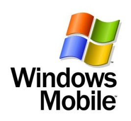

[**إطلاق ثم سحب الـ SDK الخاص بـ Windows Mobile 6.5.3**](https://www.it-scoop.com/2010/01/%d8%a5%d8%b7%d9%84%d8%a7%d9%82-%d8%ab%d9%85-%d8%b3%d8%ad%d8%a8-%d8%a7%d9%84%d9%80-sdk-%d8%a7%d9%84%d8%ae%d8%a7%d8%b5-%d8%a8%d9%80-windows-mobile-6-5-3/)

أطلقت Microsoft عن طريق الخطأ الـ SDK  الخاص بـ Windows Mobile 6.5.3 ثم قامت بسحبه أياما قليلة بعد ذلك، و ذلك لكون الإطلاق كان عن طريق الخطأ.

حسب تحديث لحساب Twitter الخاص بفريق التطوير فإن الإصدار الذي تم إطلاقه لم ينل نصيبه من التجارب و لهذا تم سحبه حتى تتم هذه التجارب و التحقق منها.

من المرتقب أن يحمل الإصدار 6.5.3 من Windows Mobile العديد من المزايا خاصة فيما يخص دعم الشاشات التي تعمل باللمس بشكل أفضل، إضافة إلى تغييرات في الواجهة لتسهيل التعامل مع النظام بالأصابع.
