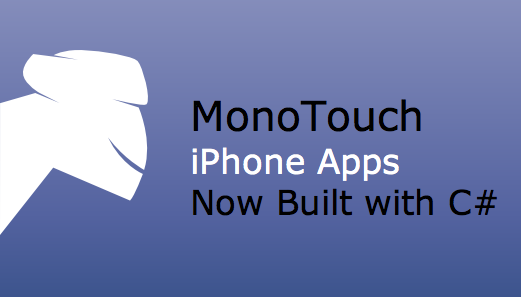

[**Novell تعلن أن MonoTouch يدعم  أيضا تطبيقات iPad**](https://www.it-scoop.com/2010/01/novell-%d8%aa%d8%b9%d9%84%d9%86-%d8%a3%d9%86-monotouch-%d9%8a%d8%af%d8%b9%d9%85-%d8%a3%d9%8a%d8%b6%d8%a7-%d8%aa%d8%b7%d8%a8%d9%8a%d9%82%d8%a7%d8%aa-ipad/)

لم تمض سوى ساعات عن إطلاق الجهاز اللوحي لـ Apple المسمى iPad و توفير الـ SDK الخاص بنظام  iPhone OS 3.2حتى أعلنت Novell أن الـ IDE الخاص بها  MonoTouch يدعم برمجة تطبيقات لهذا الجهاز.

للتذكير فإن MonoTouch عبارة عن بيئة برمجة تسمح بكتابة تطبيقات للـ iPhone  و الـ iPad اعتمادا على Mono الإصدار مفتوح المصدر من إطار عمل Dotnet الخاص بـ Microsoft.

تجدر الإشارة إلى أن المدة القصيرة التي استغرقتها Novell لعمل التحديثات اللازمة دليل آخر على أن جهاز الـ iPad لا يعدو كونه جهاز iPhone كبير الحجم.

[المصدر](http://monotouch.net/iPad)
