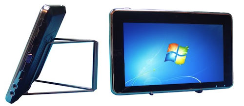
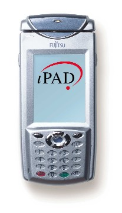

[**شركة صينية تتهم Apple بتقليد جهازها اللوحي المسوق منذ ما يزيد عن الستة أشهر**](https://www.it-scoop.com/2010/02/%d8%b4%d8%b1%d9%83%d8%a9-%d8%b5%d9%8a%d9%86%d9%8a%d8%a9-%d8%aa%d8%aa%d9%87%d9%85-apple-%d8%a8%d8%aa%d9%82%d9%84%d9%8a%d8%af-%d8%ac%d9%87%d8%a7%d8%b2%d9%87%d8%a7-%d8%a7%d9%84%d9%84%d9%88%d8%ad%d9%8a/)

جرت العادة أن يقوم المصنعون الصينيون بتقليد المنتجات الأمريكية و إنتاجها محليا لتغطية طلب السوق الصيني، لكن الأمر مختلف هذه المرة ، حيث اتهمت شركة Shenzhen Great Long Brother Industrial الصينية Apple بتقليدها لجهازها اللوحي Tablet P88 و الذي تحصلت على براءة اختراع له شهر مايو الماضي، و تضيف أن جهاز iPad ما هو سوى تقليد متقن لجهازها و الذي تقوم بتوسيقه منذ ما يزيد عن الستة أشهر.

لو دققنا المقارنة بين الجهازين لوجدنا بعض الاختلافات كالقرص الصلب ذي 160 Gb على جهاز Tablet P88 مقابل ذاكرة SSD يصل أقصاها إلى 64 Gb على الـ iPad، توفر منافذ USB على الـ Tablet P88، استعمال نظام Windiws كما أن البطارية لا تعمِّر سوى ساعة و نصف مقابل العشرة ساعات التي يتمتع بها الـ iPad.

في نفس السياق، لم توفَّّق Apple في اختيار اسم جهازها iPad، إذ أنه مسجل في أوروبا [باسم شركة STmicroelectronics،](https://www.it-scoop.com/2010/01/ipad-%D8%B9%D9%84%D8%A7%D9%85%D8%A9-%D8%AA%D8%AC%D8%A7%D8%B1%D9%8A%D8%A9-%D9%85%D8%B3%D8%AC%D9%84%D8%A9-%D8%B3%D9%84%D9%81%D8%A7-%D9%81%D9%8A-%D8%A3%D9%88%D8%B1%D9%88%D8%A8%D8%A7%D8%8C-%D9%84%D9%83/) إضافة إلى تسويق شركة  Fujitsu  لجهاز إلكتروني يحمل نفس الاسم على أرض الولايات المتحدة الأمريكية مما يزيد من التعقيدات التي يواجهها الجهاز و الذي قد لن تتمكن Apple من تسويقه على شكله الحالي.

هذا دون أن ننسى المنافسة الشرسة التي يعاني منها الجهاز من طرف العديد من المصنعين الكبار على[ غرار الجهاز اللوحي المنتظر لـ Microsoft و المصنع من طرف HP](https://www.it-scoop.com/2010/01/%D8%AC%D9%87%D8%A7%D8%B2-%D9%84%D9%88%D8%AD%D9%8A-%D8%B4%D8%A8%D9%8A%D9%87-%D8%A8%D8%A7%D9%84%D9%80-islate-%D9%84%D9%83%D9%86-%D9%87%D8%B0%D9%87-%D8%A7%D9%84%D9%85%D8%B1%D8%A9-%D9%85%D9%86-hp-%D9%88-m/)

- كيف تتوقعون أن تخرج Apple  من جملة العقبات التي تواجهها؟
