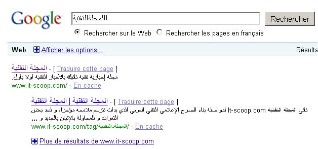

[**Google  تدخل تحسينات على خوارزميات بحثها الخاصة اللغة العربية**](https://www.it-scoop.com/2010/02/google-%d8%aa%d8%af%d8%ae%d9%84-%d8%aa%d8%ad%d8%b3%d9%8a%d9%86%d8%a7%d8%aa-%d8%b9%d9%84%d9%89-%d8%ae%d9%88%d8%a7%d8%b1%d8%b2%d9%85%d9%8a%d8%a7%d8%aa-%d8%a8%d8%ad%d8%ab%d9%87%d8%a7-%d8%a7%d9%84%d8%ae/)

أعلنت Google  على مدونتها الرسمية إدخالها جملة من التحسينات على محرك بحثها تخص اللغة العربية.

التحسينات المضافة تخص بالأساس أمرين، الأول هو إمكانية نسيان المسافات لدى كتابة جملة في محرك البحث كأن تكتب : المجلةالتقنية بدل المجلة التقنية.

الأمر الثاني يخص إمكانية تكرار بعض الأحرف أكثر من مرة عن طريق الخطأ ككتابة االمجلة االتقنية  (لاحظ تكرار الألف).

تم تحسين خوارزميات البحث بطريقة تمكنها من معرفة الأحرف المكررة عن طريق الخطأ إضافة إلى معرفة مواضع المسافات المنسية .

على سبيل المثال لاحظ كيف يستطيع Google معرفة ما الذي نقصده تماما لدى كتابة االمجلةالتقنية

يمكن الإطلاع على إعلان Google عن التحسينات الجديدة من [هنا](http://googleblog.blogspot.com/2010/02/recent-improvement-for-arabic-searches.html)

شكر خاص للأخ وائل دلول لإعلامنا بالخبر
