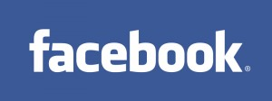

[**البريد الإلكتروني قريبا على Facebook**](https://www.it-scoop.com/2010/02/%d8%a7%d9%84%d8%a8%d8%b1%d9%8a%d8%af-%d8%a7%d9%84%d8%a5%d9%84%d9%83%d8%aa%d8%b1%d9%88%d9%86%d9%8a-%d9%82%d8%b1%d9%8a%d8%a8%d8%a7-%d8%b9%d9%84%d9%89-facebook/)

إذا صدق ما أشارت إليه مدونة [Techcrunch](http://www.techcrunch.com/2010/02/05/facebooks-project-titan-a-full-featured-webmail-product/) فإن Facebook بصدد التحضير لإضافة البريد الإلكتروني للشبكة الاجتماعية قريبا.

المشروع الذي تعمله عليه Facrbook حاليا و المسمى Titan سيتيح –لدى إنهاء العمل عليه- Webmail بكل ما تحمله الكلمة من معنى، بعبارة أخرى سيكون منافسا قويا لـ Gmail الـ Webmail المقدم من Google.

السؤال الذي يتبادر إلى الأذهان الآن، هو لماذا تود Facebook تطوير مثل هذا المشروع؟ الجواب هو أنه بكل تأكيد نظرا  من جهة أن نظام تبادل الرسائل الحالي على الشبكة الاجتماعية ليس متطورا إذ يفتقر إلى العديد من المزايا الموجودة في الـ webmail الكلاسيكية، و من جهة أخرى  فإن عدد المشتركين الحالي سيجعل من الـ webmail الخاص بـ Facebook جديرا بالثقة و منافسة Gmail بالتحديد، مما سيدعم من قوة الشبكة الاجتماعية أيضا.

سيكون الـ webmail هذا متوافقا مع الـ POP و الـ IMAP مما يعني إمكانية استعمال برامج قراءة البريد للانتفاع بهذه الخدمة.

و من المرتقب أن تكون العناوين على شاكلة it-scoop@facebook.com

- هل ستتوقع نجاح مثل هذه الفكرة؟ و هل هناك مجال لمنافسة حقيقية لـ Gmail ؟
