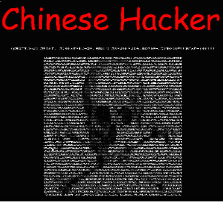

[**إغلاق أكبر موقع لتعليم الاختراق الإلكتروني في الصين**](https://www.it-scoop.com/2010/02/%d8%a5%d8%ba%d9%84%d8%a7%d9%82-%d8%a3%d9%83%d8%a8%d8%b1-%d9%85%d9%88%d9%82%d8%b9-%d9%84%d8%aa%d8%b9%d9%84%d9%8a%d9%85-%d8%a7%d9%84%d8%a7%d8%ae%d8%aa%d8%b1%d8%a7%d9%82-%d8%a7%d9%84%d8%a5%d9%84%d9%83/)

قامت السلطات المحلية في مقاطعة Hubei وسط الصين بإغلاق موقع (Black Hawk Safety Net) الصيني, المخصص لتعليم وتدريب أساليب التسلل والاختراق عبر النت.

وفي الخبر المنسوب للصحافة المحلية, تم اعتقال 3 أشخاص ومصادرة 3 أجهزة كمبيوتر و 9 من Web servers وسيارة واحدة, وإيقاف الموقع بشكل كامل.

واستناداً لسلطات المقاطعة, فالموقع يعد الأكبر في الصين من حيث عدد إعضائه, فمنذ إطلاقه عام 2005 وصلت عضويات الموقع الى  أكثر من 12,000 عضو VIP, و إنه قد تم جمع أكثر من 7 ملايين يوان صيني, لقاء رسوم العضوية وخدمات التدريب وتوفير برمجيات الهجوم والاختراق.

فضلاً عن أكثر من 170,000 شخص تم تسجيلهم في العضوية المجانية.

[المصدر](http://www.chinadaily.com.cn/china/2010-02/08/content_9440667.htm)
