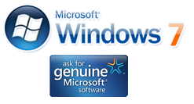

[**قريبا... Patch اختياري لاكتشاف نسخ windows7 غير الأصلية**](https://www.it-scoop.com/2010/02/%d9%82%d8%b1%d9%8a%d8%a8%d8%a7-patch-%d8%a7%d8%ae%d8%aa%d9%8a%d8%a7%d8%b1%d9%8a-%d9%84%d8%a7%d9%83%d8%aa%d8%b4%d8%a7%d9%81-%d9%86%d8%b3%d8%ae-windows7-%d8%ba%d9%8a%d8%b1-%d8%a7%d9%84%d8%a3%d8%b5/)

أعلن  Joe Williams على [ مدونة Genuine Windows Blog](http://windowsteamblog.com/blogs/genuinewindows/archive/2010/02/11/windows-activation-technologies-update-for-windows-7.aspx?PageIndex=1) أن Microsoft  ستطلق قريبا Patch يسمح باكتشاف النسخ غير الأصلية من نظام Windows7، و لن يكون تنصيبه إجباريا.

من شأن الـ Patch و الذي سيرى النور في الأيام القليلة القادمة أن يكتشف ما إن كانت نسخة النظام تستعمل إحدى الـ Hacks السبعين المتوفرة حاليا على الإنترنت و التي تسمح بتشغيل نظام windows7 بطريقة غير قانونية.

الغريب في الأمر أن الـ Patch و الذي سيتم توفيره من خلال الـ windows Update لن يكون إجباريا، بمعنى أن المستخدم له الحق في رفض تنصيبه حتى و إن لم تكن نسخة نظامه أصلية، لكن Microsoft ترد على هذه النقطة بكونها حريصة على أمن المستخدم أكثر من أي شيء آخر، و تدعم موقفها بدراسة قامت بها الشركة الألمانية Media Surveillance و التي تشير إلى أنها قامت بتحميل أكثر من 500 نسخة غير أصلية من Windows7 على الإنترنت و وجدت أن 32% منها تحتوي برامج ضارة مضمنة في هذه الأنظمة.

سيسمح الـ Patch بمعرفة ما إذا كانت النسخة أصلية و بالتالي تحذير المستخدم "الشرعي" في حال تم اكتشاف أية برامج ضارة مضمنة في النظام، أم المستعلمون "غير الشرعيون" فسيتم إظهار رسائل لهم تخبرهم بوجوب الحصول على نسخ أصلية دون أن يتم الحد من وظائف النظام،عدا تغيير خلفية سطح المكتب و إظهار الرسائل التذكيرية بصفة دورية.

هل تظنون أن Microsoft تحاول الحفاظ على حصتها من أنظمة التشغيل حتى و لو اقتضى الأمر السماح باستعمال نسخ غير أصلية من أنظمتها؟
