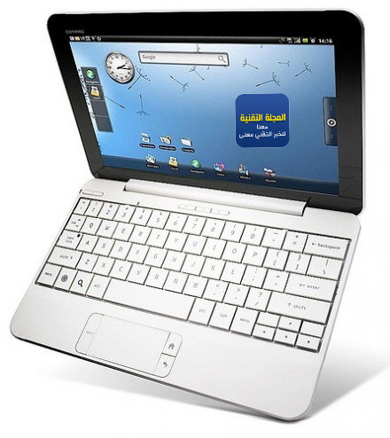

[**HP  تكشف النقاب عن Airlife 100  الـ Smartbook  الذي يجمع بين خصائص الـ Smartphone و الـ Netbook**](https://www.it-scoop.com/2010/02/hp-%d8%aa%d9%83%d8%b4%d9%81-%d8%a7%d9%84%d9%86%d9%82%d8%a7%d8%a8-%d8%b9%d9%86-airlife-100-%d8%a7%d9%84%d9%80-smartbook-%d8%a7%d9%84%d8%b0%d9%8a-%d9%8a%d8%ac%d9%85%d8%b9-%d8%a8%d9%8a%d9%86-%d8%ae/)

كشفت HP عن أحدث منتوجاتها و التي تجمع بين مواصفات الـ Smartphone و الـ netbook و التي يطلق عليها اسم Smartbook .

الجهاز الجديد يمتاز ظاهريا بما يمتاز بـ الـ netbooks العادية بشاشته ذات 10.1 بوصة، و بلوحة مفاتيحه الكاملة، إضافة إلى القرص الصلب ذي الـ 16 Gb و البطارية ذات المدى الطويل الذي يصل إلى 12 ساعة، لكن باطنيا الأمر مختلف تماما، إذ نجد كل خصائص الـ Smartphones بدءً بالاتصال 3G / 3G+ / Wi-Fi وصولا إلى معالج SnapDragon المصنع من طرف Qualcomm ، دون أن ننسى نظام تشغيل Android.

من جهة أخرى فإن استعمال مصطلح Smartbook يبدو غير ممكن، إذ أنه من جهة تشير شركة  Qualcomm المصنعة للمعالجات أنها أول من استعمل هذا المصطلح في حين تدعي شركة  Smartbook AG  الألمانية أحقيتها بالاسم ، و هو ما سيدفعنا إلى مشاهدة أطوار حلقة أخرى من التلاكم و تبادل تهم عدم احترام براءات الاختراع  بين هذه  الأطراف إذا ما واصلت كل شركة ادعاء أحقيتها بالاسم و مطالبتها بالحقوق الحصرية له.

تجدر الإشارة إلى أن HP ليست أول من يطرح جهازا من هذا النوع إذ سبق و أن أعلنت Lenovo  عن جهاز من نفس النوع.

هل تتوقعون ظهور طلب على مثل هذه الأجهزة في المستقبل القريب؟ و هل تظنون أنها عملية نظرا إلى حجمها؟
