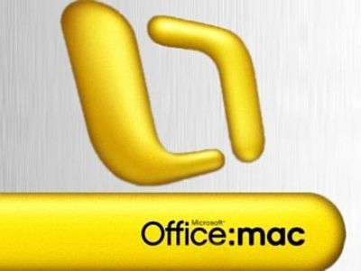

[**Microsoft تكشف الستار عن مستجدات Office 2011 لأنظمة Mac المرتقب صدوره نهاية العام الجاري**](https://www.it-scoop.com/2010/02/microsoft-%d8%aa%d9%83%d8%b4%d9%81-%d8%a7%d9%84%d8%b3%d8%aa%d8%a7%d8%b1-%d8%b9%d9%86-%d9%85%d8%b3%d8%aa%d8%ac%d8%af%d8%a7%d8%aa-office-2011-%d9%84%d8%a3%d9%86%d8%b8%d9%85%d8%a9-mac-%d8%a7%d9%84%d9%85/)

من المنتظر صدور الحزمة المكتبية Office 2011  لأنظمة Mac خلال نهاية العام الحالي، و اغتنمت Microsoft فرصة مؤتمر Macworld للكشف عن أهم مستجدات الإصدار القادم من حزمتها المكتبية.

سيسجل شريط الأدوات الخاص بـ Office 2007 دخوله في هذا الإصدار كما سيعوض برنامج Outlook برنامج Entourage و الذي سيتضمن أداة البحث Mac Spotlight و خاصية حفظ الملفات باستخدام Time Machine، دون أن ننسى دعم الملفات .PST و التي تسمح باستيراد البيانات المصدرة باستعمال إصدار Windows لـ Outlook.

في [حديث خص به موقع T3](http://www.t3.com/news/microsoft-hints-at-office-for-ipad?=43603) أكد Mike Tedesco الـ Product Manager لدى Microsoft أنهم يفكرون جديا في توفير نسخة من الحزمة المكتبية لأجهزة الـ iPad، لكن يؤكد أنه لم يتم اتخاذ بعد أية قرارات بهذا الشأن و الأمر لا يزال في مرحلة الدراسة.

تجدر الإشارة إلى أن إصدارات Office لأنظمة Mac تأتي دائما في السنة الموالية لإطلاق الإصدار الخاص بنظام Windows (الإصدار 2011 على الـ Mac  موافق للإصدار 2010 على الـ Windows).
