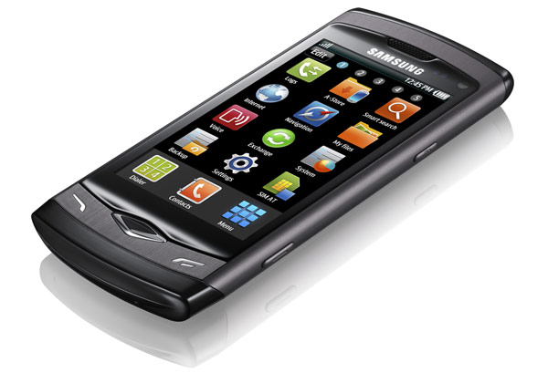

[**Samsung  تكشف النقاب عن هاتف Wave S8500 المجهز بنظام Bada**](https://www.it-scoop.com/2010/02/samsung-%d8%aa%d9%83%d8%b4%d9%81-%d8%a7%d9%84%d9%86%d9%82%d8%a7%d8%a8-%d8%b9%d9%86-%d9%87%d8%a7%d8%aa%d9%81-wave-s8500-%d8%a7%d9%84%d9%85%d8%ac%d9%87%d8%b2-%d8%a8%d9%86%d8%b8%d8%a7%d9%85-bada/)

يتم اليوم افتتاح في برشلونة الإسبانية افتتاح مؤتمر **MWC 2010** Mobile World Congress، و الذي يشهد الإعلان عن آخر التقنيات في عالم الهواتف النقالة و أنظمة تشغيلها.

البداية هذه المرة مع  Samsung حيث كشف عن أحدث أجهزتها Wave S8500 و المجهز بنظامها الخاص الجديد Bada.

Wave S8500 يمتاز بشاشة AMOLED ذات 3.3 بوصة و التي تصل دقة عرضها إلى 800x480  Pixels. و يعتبر أول هاتف مجهز بتقنية Bluetooth 3.0 و هو ما سيمكنه من استعمال البروتوكول 802.11 لنقل بيانات بسرعة  24 Mbps.

كما يحظى بمعالج يصل تردده إلى 1 Ghz و بذاكرة تقدر بـ 2 Gb.

أما من ناحية واجهة المستخدم فجهاز Wave S8500 يستعمل واجهة TouchWiz 3.0 المقدمة من طرف Samsung.

من المتوقع نزول جهاز Wave S8500 إلى الأسواق خلال شهر أبريل القادم.

[المصدر](http://www.engadget.com/2010/02/14/samsung-wave-first-hands-on-bada-packed-and-super-fast/)
