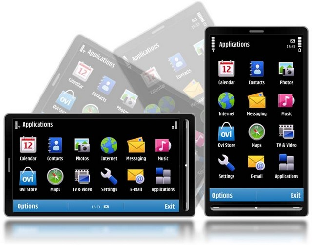

[**ظهور أولى بشائر نظام Symbian^3 خلال مؤتمر MWC 2010**](https://www.it-scoop.com/2010/02/%d8%b8%d9%87%d9%88%d8%b1-%d8%a3%d9%88%d9%84%d9%89-%d8%a8%d8%b4%d8%a7%d8%a6%d8%b1-%d9%86%d8%b8%d8%a7%d9%85-symbian3-%d8%ae%d9%84%d8%a7%d9%84-%d9%85%d8%a4%d8%aa%d9%85%d8%b1-mwc-2010/)

كشفت مؤسسة Symbian اليوم خلال مؤتمر MWC 2010 المقام في برشلونة الإسبانية عن أولى بشائر آخر إصدارات نظام Symbian و المتمثل في Symbian^3 و هو أول إصدار من نظام Symbian بعد أن  تولت مؤسسة Symbian مسؤوليته.

النظام الجديد يحتوي على واجهة جديدة مغايرة تماما لما كان عليه سابقا، كما يدعم معيار HDMI مما يسمح للأجهزة المستقبلية المجهزة بمخرج HDMI  الاتصال بأجهزة التلفزيون لعرض الفيديوهات عالية الجودة عليها.

يأتي  Symbian^3  بنظام لإدارة الذاكرة تسمح له بتشغيل أكثر من برنامج في آن واحد دون أن يتم تقليل أداء النظام، إضافة إلى خاصية جديدة تسمح للهاتف المرور من اتصال بالشبكة الخليوية إلى الـ Wi-Fi دون أي انقطاع.

من المتوقع إنهاء العمل على نظام Sybmbian^3 مع نهاية الشهر الحالي، لكن أولى الهواتف الذكية المجهزة به لن ترى النور قبل الربع الثالث من العام الجاري.

- ما رأيك في خصائص الإصدار الجديد من Symbian^3
