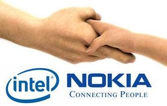

[**Nokia و Intel تدمجان نظامي  Maemo و Mobilin لإنتاج نظام Meego  المجاني و مفتوح المصدر**](https://www.it-scoop.com/2010/02/nokia-%d9%88-intel-%d8%aa%d8%af%d9%85%d8%ac%d8%a7%d9%86-%d9%86%d8%b8%d8%a7%d9%85%d9%8a-maemo-%d9%88-mobilin-%d9%84%d8%a5%d9%86%d8%aa%d8%a7%d8%ac-%d9%86%d8%b8%d8%a7%d9%85-meego-%d8%a7%d9%84%d9%85/)

كما أن كثرة أنظمة تشغيل الهواتف الذكية تقتل أنظمة التشغيل، فإن قلتها باتحادها تقويها أكثر فأكثر، و هذا ما انتهجته كل من Nokia و Intel بإعلانهما دمج نظاميهما Maemo المنتج من طرف الأولى و Mobilin المنتج من طرف الثاني لإنتاج نظام موحد تحت اسم Meego.

النظام الجديد و الذي سيكون مجانيا و مفتوح المصدر، لن يكون موجها للهواتف فقط كما كان عليه الحال مع Meamo أو للـ Netbooks فقط كما كان عليه الحال مع Mobilin و إنما يتعداها إلى كل من الأجهزة اللوحية، و الـ SmartBooks و الـ PocketPCs و حتى أجهزة الحاسوب المدمجة مع السيارات الحديثة.

قد يكون التفسير الوحيد لمثل هذا الاندماج هو نقص الإبداع في الهواتف التي تعاني منها Nokia في الآونة الأخيرة، و عدم قدرة Intel على فرض نفسها كمنتج قوي في عالم الـ Netbooks .

المشكل الذي قد يواجهه النظام الجديد ، هو قدرة كل من Nokia و Intel على إقناع المصنعين على الإقبال على النظام الجديد و الذي سيدعم المعماريتين ARM و Atom في آن واحد، في ظل الأشواط التي يسبقها بها كل من Android كنظام و الـ iPhone كبيئة تستقطب مطوري البرامج.

- هل تتوقع أن تنجح هذه الشراكة و هذا النظام الجديد؟
