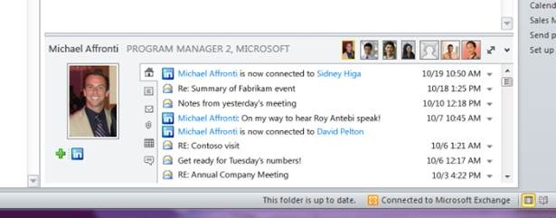

[**Facebook، Myspace و LinkedIn قريبا على الـ Outlook**](https://www.it-scoop.com/2010/02/facebook%d8%8c-myspace-%d9%88-linkednin-%d9%82%d8%b1%d9%8a%d8%a8%d8%a7-%d8%b9%d9%84%d9%89-%d8%a7%d9%84%d9%80-outlook/)

أطلقت Microsoft الإصدار Beta للإضافة الجديدة Outlook Social Connector و التي تسمح بإظهار رفقة كل رسالة مستقبَلة نشاطَ المرسِل على الشبكات الاجتماعية الرئيسية Facebook، Myspace و LinkedIn.

الإضافة الجديدة متوافقة مع كل من Office 2003،2007 و الإصدار Beta لـ 2010، و التي ستظهر بعد تنصيبها قسما خاصا على كل رسالة مستقبَلة تحتوي على آخر نشاطات المرسِل، إضافة إلى ملخص للرسائل و الملفات التي أرسلها و القيام بتزامن مع رزنامة Outlook لإظهار الاجتماعات المزمع عقدها مع المرسِل.

الإضافة الخاصة بـ LinkedIn متوفرة حالية للتحميل، أما تلك التي تخص كل من Facebook، Myspace فمن المتوقع أن يكون إطلاقها متزامنا مع الإطلاق  الرسمي للحزمة المكتبية Office 2010.

على صعيد متصل فقد نقلت وكالة الـ Associated Press امتعاض بعض زبائن Microsoft من الإضافات الجديدة، والتي –حسب زعمهم- سيكون لها تأثير سلبي على مردودية الموظفين، و تشتيت انتباههم بالمعلومات الإضافية التي سترفق مع كل رسالة.

يمكن تحميل الإصدار Beta للإضافة Outlook Social Connector من [هنا](http://download.microsoft.com/download/3/D/B/3DB1CEFB-6F12-4E1A-A5B4-F0E156842158/osc.msi).

-   هل تعتقد أن مثل هذه الإضافة سيكون لها تأثير سلبي على مردودية الموظفين الذين سيستعملونها؟
